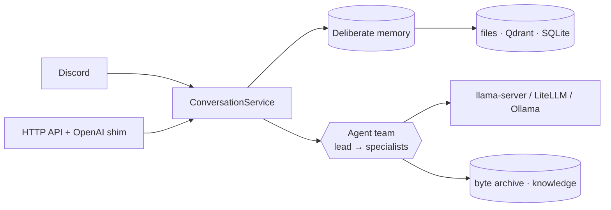

# magi

<p align="center">
  
</p>

Personal multi-channel AI assistant on the [Agno](https://www.agno.com/) framework.
One shared agent brain, many channel adapters. Model-agnostic — local
llama.cpp `llama-server` by default (direct with `model_provider="llamacpp"`, or
through the LiteLLM proxy); Claude via the proxy; Ollama kept as dormant fallback.

> **The name.** *MAGI* is the supercomputer at the heart of NERV in *Neon Genesis
> Evangelion* — three linked units (Melchior, Balthasar, Casper) that reason as
> one and reach decisions by majority vote. The nod fits: one shared brain backed
> by a roster of specialized members, speaking through many channels.

## What it is

magi is the **reusable core of a personal AI assistant** — not one bot, but the
engine several bots share. Its goals:

- **One shared brain, many channels.** A Discord bot, an HTTP API, and an
  OpenAI-compatible shim all drive the *same* assembled stack; only the transport
  differs.
- **Deliberate memory.** The assistant's durable knowledge of a user lives in
  inspectable files written *on purpose* by a post-turn curator — never silently
  auto-extracted. You can open them and read what it remembers.
- **Model-agnostic.** Local `llama-server` by default; Claude (via LiteLLM) and
  Ollama drop in without touching the team code.
- **Engine + persona.** Boots and chats with a neutral demo persona; a private
  persona repo overlays prompts and registers its own specialists without forking.



## Admin dashboard

A web dashboard to **inspect and edit everything the assistant remembers** — the
counterpart to deliberate memory. Browse users and their curated facts, read
sessions as a chat transcript, manage the knowledge corpus, and edit the global
persona. Built on the [`@carneirofc/ui`](https://github.com/carneirofc/deedlit.dev)
design system with light/dark themes. See [`web/`](web/README.md) to run it.

<p align="center">
  
</p>

## Documentation

Full docs live in [`docs/`](docs/):

| Topic | Doc |
|---|---|
| Install & run, first chat, Open WebUI | [getting-started.md](docs/getting-started.md) |
| Design, request lifecycle, diagrams | [architecture.md](docs/architecture.md) |
| Deliberate memory (the centerpiece) | [memory.md](docs/memory.md) |
| Discord / HTTP / OpenAI shim contracts | [channels.md](docs/channels.md) |
| Desktop app client (embed or HTTP SDK) | [desktop.md](docs/desktop.md) |
| Every configuration field | [configuration.md](docs/configuration.md) |
| Team, members, tool catalog | [agent-and-tools.md](docs/agent-and-tools.md) |
| Docker services, ports, ingestion | [infrastructure.md](docs/infrastructure.md) |

The rest of this README is a quick operational reference. Domain vocabulary is
defined in [CONTEXT.md](CONTEXT.md); architecture decisions in [docs/adr/](docs/adr/).

## Run

```bash
python main.py          # Discord bot (needs DISCORD_BOT_TOKEN)
python main_api.py      # standalone HTTP service for external clients
```

Both serve the same brain (`magi/channels/bootstrap.py`); only the transport differs.

The admin surface (memory + knowledge management, `magi/channels/admin.py`, see
ADR 0002) normally runs as its own process (`main_admin.py`) behind the Next.js
BFF. Set `admin_enabled=True` in `main.py` / `main_api.py` to serve it alongside
the bot instead — one process, no second `python main_admin.py` to keep running.
On the HTTP API it rides the same port (`/admin/v1/*`); on Discord it opens a
second local port (`admin_host`/`admin_port`). Keep `ADMIN_AUTH_TOKEN` set and the
admin port unpublished either way.

### Run in Docker

To run the app itself in a container, build it locally and bring it up with the
example compose. `docker-compose.yaml` holds the *supporting* services;
[`docker-compose.app.yaml`](docker-compose.app.yaml) adds the app on top, built
from the [`Dockerfile`](Dockerfile) (uv, Python 3.14):

```bash
# HTTP API + OpenAI shim on :8000 (needs a llama-server on the host :8888)
docker compose -f docker-compose.app.yaml up --build api

# app + supporting services together
docker compose -f docker-compose.yaml -f docker-compose.app.yaml up --build

# the Discord bot instead (needs DISCORD_BOT_TOKEN in .env)
docker compose -f docker-compose.app.yaml --profile discord up --build discord
```

The container reaches the host's `llama-server` (and any other host-published
service) via `host.docker.internal`, exactly as the host-run app reaches
`localhost`. Config stays code-first: the container entrypoints
(`main_api_docker.py` / `main_discord_docker.py`) reuse each deployment's
`apply_deployment_config()` and overlay only the bits that differ in a container
(bind `0.0.0.0`, point the backend URL at the host). To enable an optional extra
in the image, pass it at build time: `EXTRAS="--extra s3" docker compose -f
docker-compose.app.yaml up --build`.

## Desktop apps (GUI)

[`magi.client`](src/magi/client/__init__.py) is the front door for a desktop GUI:
one surface, two interchangeable backends. Embed the whole brain in a Python GUI
(`embed(...)`) with no server, or talk to a running `main_api.py` over HTTP
(`connect(...)`) — same call sites either way, same durable memory for the same
`user_id`. `SyncClient` wraps either one in blocking methods for toolkits that
own the main thread (Tkinter, PyQt/PySide, wx).

```python
from magi.client import SyncClient, embed, connect

ui = SyncClient(embed(user_id="local"))                 # in-process, no server
# ui = SyncClient(connect("http://127.0.0.1:8000", user_id="local"))  # over HTTP
print(ui.send("hello").text)
for chunk in ui.stream("tell me more"):                 # streamed deltas
    ...
ui.close()
```

Full walkthrough and a runnable Tkinter example
([`examples/desktop_chat.py`](examples/desktop_chat.py)) in
[docs/desktop.md](docs/desktop.md). The HTTP contract those clients speak is
below.

## HTTP API

For a desktop app or any other client. JSON over HTTP, session-scoped
(see `magi/channels/api.py` for the contract):

```
GET  /healthz
POST /v1/sessions/{session_id}/messages          {"user_id": "...", "text": "..."}
POST /v1/sessions/{session_id}/messages/stream   same body, reply streamed over SSE
POST /v1/sessions/{session_id}/flush             {"user_id": "..."}
GET  /v1/sessions/{session_id}/context           ?user_id=...
```

The two message endpoints are interchangeable per request: plain JSON gives the
whole reply at once; the SSE variant emits `delta` events (`{"text": chunk}`)
while the model writes, then one terminal `done` event with the full reply JSON
(authoritative — errors arrive as `done` with `is_error: true`).

The client owns the ids: `user_id` scopes memory (durable per person),
`session_id` scopes one conversation.

Media flows both ways. Replies carry the media the agent delivered (base64 or a
URL). Requests may carry inbound images for the agent to see — `images: [{...}]`
on the message body (`data_base64` or `url`; a `data:` URI works too). Whether
the model actually *sees* them depends on the backend having vision (e.g. a
llama-server with an mmproj loaded).

### OpenAI-compatible shim

The same brain also answers OpenAI's chat-completions format, so off-the-shelf
chat UIs (Open WebUI, LibreChat, …) work with no custom code:

```
GET  /v1/models                 advertises one model id, "chatbot"
POST /v1/chat/completions        OpenAI chat completions; set "stream": true for SSE
```

It bridges stateless wire → stateful brain: OpenAI clients resend the whole
transcript, but the agent keeps its own session memory, so only the last user
message is forwarded. OpenAI carries no session id, so one is derived from a
stable hash of the chat's first message (same chat → same server session); send
`X-Session-Id` (and `X-User-Id`) to be exact. Uploaded images (sent as
`image_url` `data:` URIs) are forwarded to the agent; reply media is folded back
into the message text as markdown.

## Chat UI (Open WebUI)

[Open WebUI](https://github.com/open-webui/open-webui) is a ready-made chat
front end. Point it at the shim and you get a full UI for free.

Open WebUI runs in Docker, so the app must be reachable from the container: bind
it to `0.0.0.0` (set `api_host="0.0.0.0"` in `main_api.py`) and set
`API_AUTH_TOKEN` in `.env`, since the port is now non-local.

PowerShell:

```powershell
# 1. Start the chatbot HTTP service (OpenAI-compatible shim on :8000).
python main_api.py

# 2. In another terminal, run Open WebUI pointed at the app. Open WebUI needs a
#    non-empty key; use your API_AUTH_TOKEN (any string works if auth is off).
$key = if ($env:API_AUTH_TOKEN) { $env:API_AUTH_TOKEN } else { "sk-noauth" }
docker run -d -p 3000:8080 `
  --add-host=host.docker.internal:host-gateway `
  -e OPENAI_API_BASE_URL=http://host.docker.internal:8000/v1 `
  -e OPENAI_API_KEY=$key `
  -v open-webui:/app/backend/data `
  --name open-webui ghcr.io/open-webui/open-webui:main
```

Bash:

```bash
# 1. Start the chatbot HTTP service (OpenAI-compatible shim on :8000).
python main_api.py

# 2. In another terminal, run Open WebUI pointed at the app. Open WebUI needs a
#    non-empty key; use your API_AUTH_TOKEN (any string works if auth is off).
docker run -d -p 3000:8080 \
  --add-host=host.docker.internal:host-gateway \
  -e OPENAI_API_BASE_URL=http://host.docker.internal:8000/v1 \
  -e OPENAI_API_KEY="${API_AUTH_TOKEN:-sk-noauth}" \
  -v open-webui:/app/backend/data \
  --name open-webui ghcr.io/open-webui/open-webui:main
```

Browse to <http://localhost:3000>, create the first account, and pick the
`chatbot` model — it's auto-discovered via `/v1/models`. Each Open WebUI
conversation maps to its own server-side session automatically.

## Configuration

Code-first: each entrypoint sets its deployment in `apply_deployment_config()`
(see `main.py` / `main_api.py`); defaults live in `magi/core/config.py`. Only
secrets come from `.env` (`DISCORD_BOT_TOKEN`, `LITELLM_MASTER_KEY`,
`LLAMACPP_API_KEY`, `QDRANT_API_KEY`, `API_AUTH_TOKEN` — the last gates `/v1`
with `Authorization: Bearer <token>`). The effective values are printed at
startup by `config.log_settings()`.

## Object storage (durable file archive)

A durable store the agent uses as **memory for bytes**: it can decide to archive
a file or image the user may want again and recall it later by reference
(`store_file` / `retrieve_file` / `list_files`). It's the byte-world sibling of
the text memory in `magi/core/memory` — same idea, deliberate writes scoped per
user. Code lives in `magi/core/storage` and `magi/agent/tools/storage.py` (the
model-facing tools). Recall delivers the actual bytes as an attachment; the
archive is private, not a public file host.

Off by default. Two interchangeable backends, picked by `storage_backend`:

- **`local`** (default once enabled) — bytes on the filesystem under
  `storage_local_dir`. No server, no boto3, no credentials.
- **`s3`** — any S3-compatible bucket (AWS S3, RustFS, MinIO). Needs the boto3
  extra and credentials.

### Local backend (zero setup)

Nothing to install or run — just turn it on in the entrypoint (`main.py` /
`main_api.py`):

```python
configure(
    storage_enabled=True,
    storage_backend="local",
    storage_local_dir="data/artifacts",  # where the bytes land
)
```

### S3 backend

```bash
uv sync --extra s3        # installs boto3 (lazy-imported; absent => tools off)
```

Set the credentials in `.env` (these are the only S3 *secrets*; bucket / region /
endpoint live in code via `configure(...)`):

```dotenv
S3_ACCESS_KEY_ID=rustfsadmin
S3_SECRET_ACCESS_KEY=rustfsadmin
```

Then turn it on in the entrypoint (`main.py` / `main_api.py`):

```python
configure(
    storage_enabled=True,
    storage_backend="s3",
    s3_endpoint_url="http://localhost:9000",  # RustFS/MinIO; None => real AWS S3
    s3_bucket="chatbot-memory",
)
```

The store degrades gracefully: with the S3 backend selected, if boto3 is missing
or the backend is unreachable at startup, the tools are simply not attached and
the bot boots normally. (The legacy `s3_enabled=True` still works — `configure()`
maps it to `storage_enabled` with the `s3` backend.)

### Launch RustFS for simple testing

[RustFS](https://github.com/rustfs/rustfs) is an S3-compatible object store. The
fastest path is the bundled compose, which runs RustFS on the canonical S3 ports
(API `9000`, console `9001`) and auto-creates the `chatbot-memory` bucket:

```bash
docker compose up -d rustfs rustfs-init
# S3 API → http://localhost:9000   console → http://localhost:9001
# default creds: rustfsadmin / rustfsadmin (override via S3_* in .env)
```

That matches the config defaults above, so `s3_endpoint_url="http://localhost:9000"`
works out of the box. (The compose also ships MinIO for LiteLLM's logs on host
ports `9100`/`9101`, so the two don't collide.)

Prefer a one-off container without compose:

```bash
docker run -d --name rustfs -p 9000:9000 -p 9001:9001 \
  -e RUSTFS_VOLUMES=/data \
  -e RUSTFS_ADDRESS=0.0.0.0:9000 \
  -e RUSTFS_CONSOLE_ADDRESS=0.0.0.0:9001 \
  -e RUSTFS_ACCESS_KEY=rustfsadmin \
  -e RUSTFS_SECRET_KEY=rustfsadmin \
  -v rustfs_data:/data \
  rustfs/rustfs:latest
```

Create the bucket once (browse to the console, or use the AWS CLI / `mc`):

```bash
aws --endpoint-url http://localhost:9000 s3 mb s3://chatbot-memory
```
