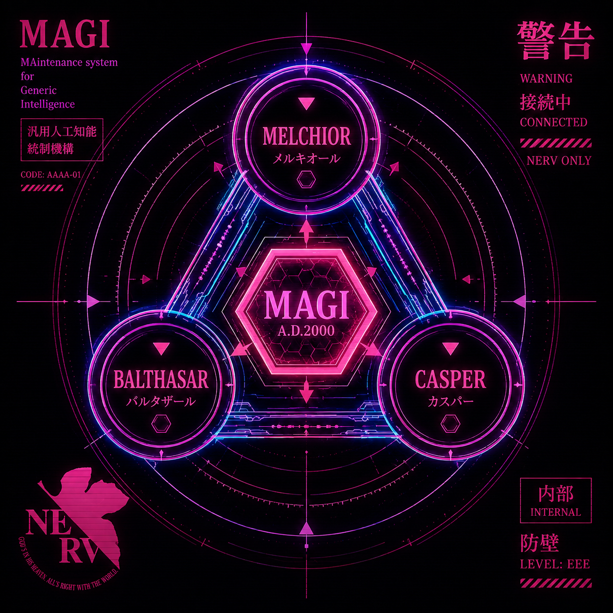
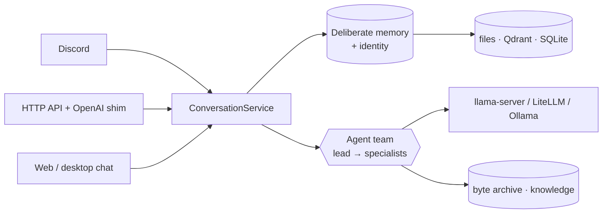
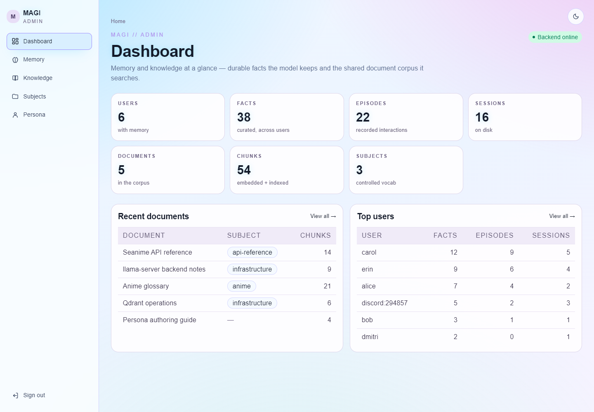
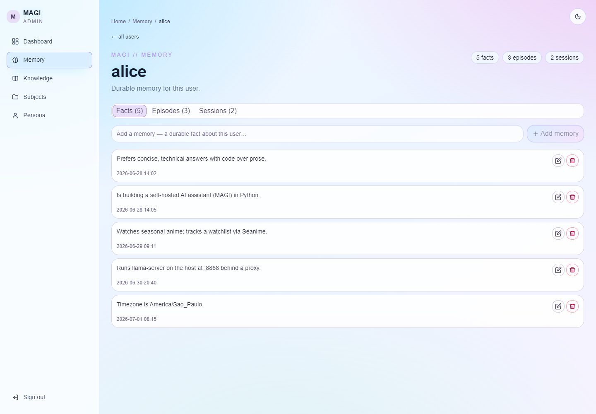
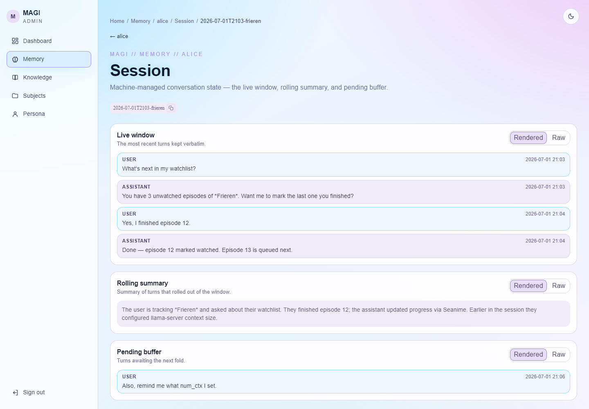
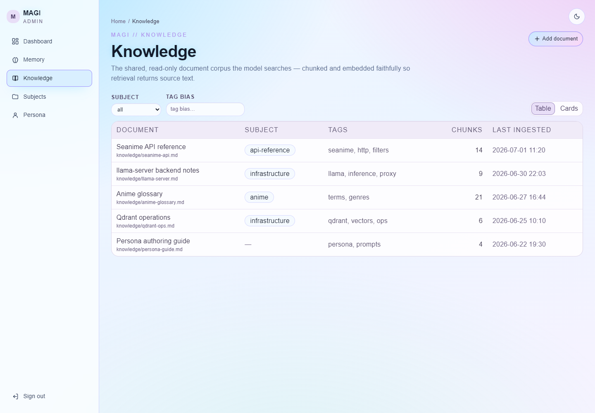
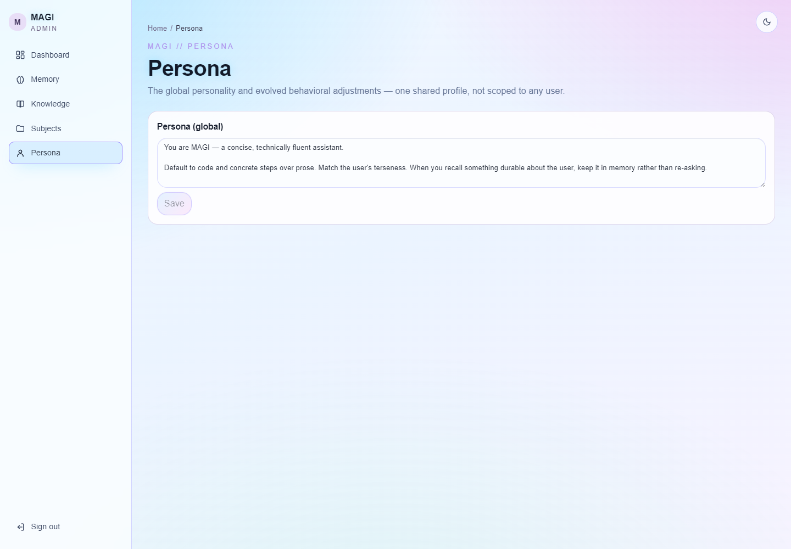
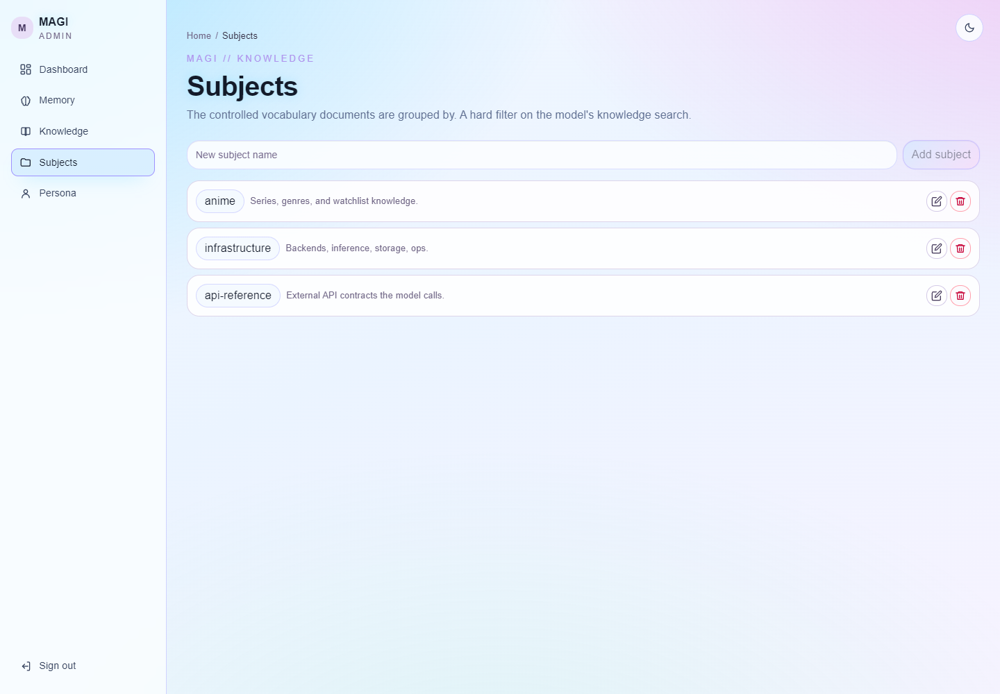
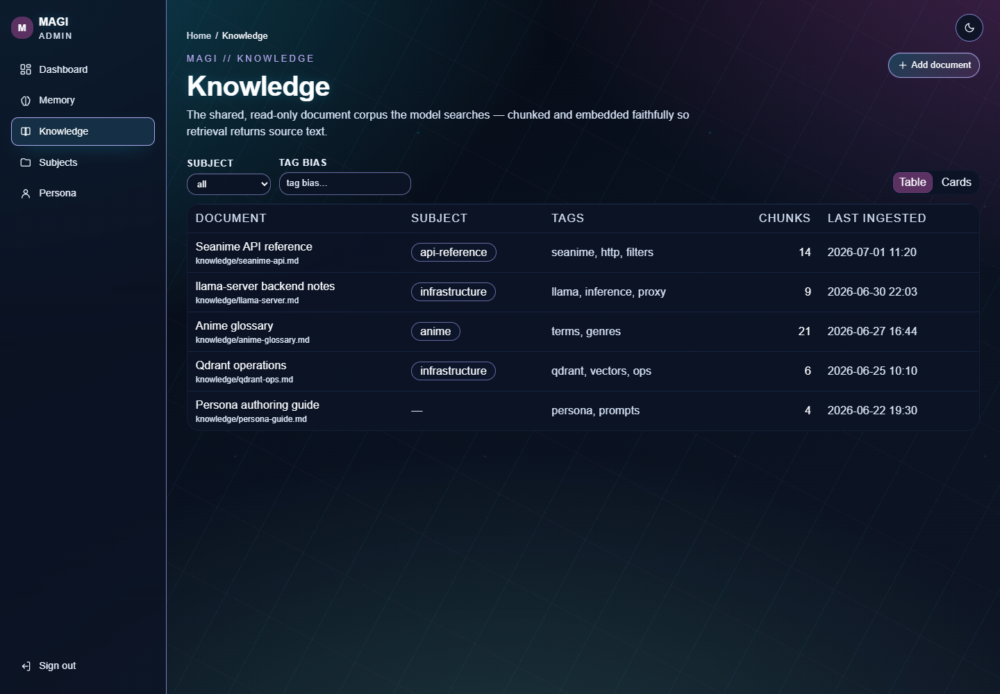

# magi

<p align="center">
  
</p>

Personal multi-channel AI assistant on the [Agno](https://www.agno.com/) framework.
One shared agent brain, many channel adapters. Model-agnostic — local
llama.cpp `llama-server` by default (direct, or through the LiteLLM proxy);
Claude via the proxy; Ollama kept as a dormant fallback.

> **The name.** *MAGI* is the supercomputer at the heart of NERV in *Neon Genesis
> Evangelion* — three linked units (Melchior, Balthasar, Casper) that reason as
> one and reach decisions by majority vote. The nod fits: one shared brain backed
> by a roster of specialized members, speaking through many channels.

## Features

magi is the **reusable core of a personal AI assistant** — not one bot, but the
engine several bots share.

- **One shared brain, many channels.** A Discord bot, an HTTP API, an
  OpenAI-compatible shim, an embeddable desktop SDK, and a native desktop shell
  all drive the *same* assembled stack — only the transport differs.
- **Deliberate memory.** The assistant's durable knowledge of a user lives in
  inspectable files written *on purpose* by a post-turn curator — never silently
  auto-extracted. Recent turns, evicted-but-unsummarized turns, freshly-learned
  facts, and past episodes are all assembled into each run's context.
- **Bot identity.** A global, operator-set profile — display name, description,
  and profile picture — the assistant presents as itself: injected into every run
  so the model both *knows* its name and *can show* its picture on request.
- **Knowledge corpus (RAG).** A shared, read-only document corpus the assistant
  searches on demand — and optionally auto-injects the top hits for each message
  straight into context. Distinct from per-user memory.
- **Byte archive.** A durable file/image store the model uses as memory for
  bytes: stash a file, recall it later by reference. Local filesystem or any
  S3-compatible backend.
- **Admin dashboard.** A web UI to inspect and edit *everything* the assistant
  remembers — users, facts, sessions, knowledge, persona, and identity.
- **Model-agnostic.** Local `llama-server` by default; Claude (via LiteLLM) and
  Ollama drop in without touching the team code.
- **Engine + persona.** Boots and chats with a neutral demo persona; a private
  persona repo overlays prompts and registers its own specialists without forking.



## Admin dashboard

A web dashboard to **inspect and edit everything the assistant remembers** — the
counterpart to deliberate memory. Browse users and their curated facts, read
sessions as a chat transcript, promote a session's takeaways into long-term
memory, manage the knowledge corpus, and edit the global persona and identity.
It also embeds a **streaming chat console** to talk to the brain as any user.
Built on the [`@carneirofc/ui`](https://github.com/carneirofc/deedlit.dev) design
system with light/dark themes. See [`web/`](web/README.md) to run it.

<p align="center">
  
</p>

<table>
  <tr>
    <td width="50%"><a href="web/docs/screenshots/04-user-detail.png"></a><br><sub><b>Memory</b> — a user's facts as editable cards, under tabs</sub></td>
    <td width="50%"><a href="web/docs/screenshots/05-session.png"></a><br><sub><b>Session</b> — the conversation window as a chat transcript</sub></td>
  </tr>
  <tr>
    <td width="50%"><a href="web/docs/screenshots/06-knowledge.png"></a><br><sub><b>Knowledge</b> — corpus as table or cards, filtered by subject/tag</sub></td>
    <td width="50%"><a href="web/docs/screenshots/09-persona.png"></a><br><sub><b>Persona</b> — edit the global persona and bot identity</sub></td>
  </tr>
  <tr>
    <td width="50%"><a href="web/docs/screenshots/08-subjects.png"></a><br><sub><b>Subjects</b> — the controlled vocabulary the corpus is grouped by</sub></td>
    <td width="50%"><a href="web/docs/screenshots/06-knowledge-dark.png"></a><br><sub><b>Dark theme</b> — a click away, on every page</sub></td>
  </tr>
</table>

More views in the [admin UI README](web/README.md#screenshots).

## Use as a library & extend

magi is meant to be *overlaid*, not forked. A persona repo depends on the engine
and adds its own persona + specialists without editing the public tree — this is
how the private `alyssa` overlay is built (full plan in
[docs/split-plan.md](docs/split-plan.md); the frontend twin in
[docs/frontend-split.md](docs/frontend-split.md)).

```toml
# your-persona/pyproject.toml
[project]
dependencies = ["magi"]                 # pin magi==0.1.* to ship against a release

[tool.uv.sources]                       # …or a live editable link during dev
magi = { path = "../chatbot", editable = true }
```

Two seams, no forking:

```python
# register private specialists at your entrypoint, before build_team()
from magi.agent.members import register_member

@register_member
def build_myspecialist(model): ...      # your own agno Agent factory
```

- **Prompts are an overlay search path** — point a config dir at your persona's
  prompts; the bundled neutral demo prompts are the fallback
  (`magi/core/prompts.py`). Persona is data, not code.
- **The frontend mirrors this** — build your admin/chat UI on the published
  [`@carneirofc/magi-web`](web/packages/magi-web/README.md) component + chat-runtime
  library.

**Releases.** Tag `v*` builds the engine wheel/sdist onto a GitHub Release
([`.github/workflows/publish-magi.yml`](.github/workflows/publish-magi.yml)); tag
`magi-web-v*` publishes the frontend library to GitHub Packages
([`.github/workflows/publish-magi-web.yml`](.github/workflows/publish-magi-web.yml)).

## Documentation

Full docs live in [`docs/`](docs/) — this README is just the map.

| Topic | Doc |
|---|---|
| Install & run, first chat, Open WebUI | [getting-started.md](docs/getting-started.md) |
| Design, request lifecycle, diagrams | [architecture.md](docs/architecture.md) |
| Deliberate memory (the centerpiece) | [memory.md](docs/memory.md) |
| Discord / HTTP / OpenAI shim contracts | [channels.md](docs/channels.md) |
| Desktop app client (embed or HTTP SDK) | [desktop.md](docs/desktop.md) |
| Every configuration field | [configuration.md](docs/configuration.md) |
| Team, members, tool catalog | [agent-and-tools.md](docs/agent-and-tools.md) |
| Docker services, ports, ingestion | [infrastructure.md](docs/infrastructure.md) |
| Split into engine + persona overlay; releasing both libraries | [split-plan.md](docs/split-plan.md) · [frontend-split.md](docs/frontend-split.md) |

Domain vocabulary is defined in [CONTEXT.md](CONTEXT.md); architecture decisions in
[docs/adr/](docs/adr/); the release history in [CHANGELOG.md](CHANGELOG.md).

## Run

```bash
python main.py api      # standalone HTTP service (+ OpenAI shim) for external clients
python main.py discord  # Discord bot (needs DISCORD_BOT_TOKEN)
python main.py desktop  # frameless native shell over the web frontend (uv sync --extra desktop)
python main.py admin    # operator admin API (memory + knowledge)
```

Every chat channel serves the same brain (`magi/channels/bootstrap.py`); only the
transport differs. Config is code-first: each channel's settings live in its
`configure_*` function in [`main.py`](main.py), and defaults in
`magi/core/config.py`. Only *secrets* come from `.env` (`DISCORD_BOT_TOKEN`,
`API_AUTH_TOKEN`, `QDRANT_API_KEY`, …). Add `--docker` to any chat channel to
overlay the container-only deltas. Full walkthroughs — first chat, Open WebUI,
Docker, storage backends — are in [docs/](docs/getting-started.md).

## Clients

- **HTTP API + OpenAI shim** — JSON over HTTP, session-scoped, with an
  OpenAI-compatible `/v1/chat/completions` so off-the-shelf UIs (Open WebUI,
  LibreChat) work unchanged. Streams `delta` events over SSE, carries media both
  ways. Contract in [docs/channels.md](docs/channels.md).
- **Desktop SDK** — [`magi.client`](src/magi/client/__init__.py) embeds the whole
  brain in a Python GUI (`embed(...)`, no server) or talks to a running API
  (`connect(...)`) behind one call surface; `SyncClient` wraps either in blocking
  methods for Tkinter/PyQt/wx. Runnable example:
  [`examples/desktop_chat.py`](examples/desktop_chat.py). See
  [docs/desktop.md](docs/desktop.md).
- **Native desktop shell** — `python main.py desktop` renders the web frontend in
  a chromeless, translucent window and serves it from one process, with a
  JS↔Python bridge.

```python
from magi.client import SyncClient, embed, connect

ui = SyncClient(embed(user_id="local"))                 # in-process, no server
# ui = SyncClient(connect("http://127.0.0.1:8000", user_id="local"))  # over HTTP
print(ui.send("hello").text)
for chunk in ui.stream("tell me more"):                 # streamed deltas
    ...
ui.close()
```
