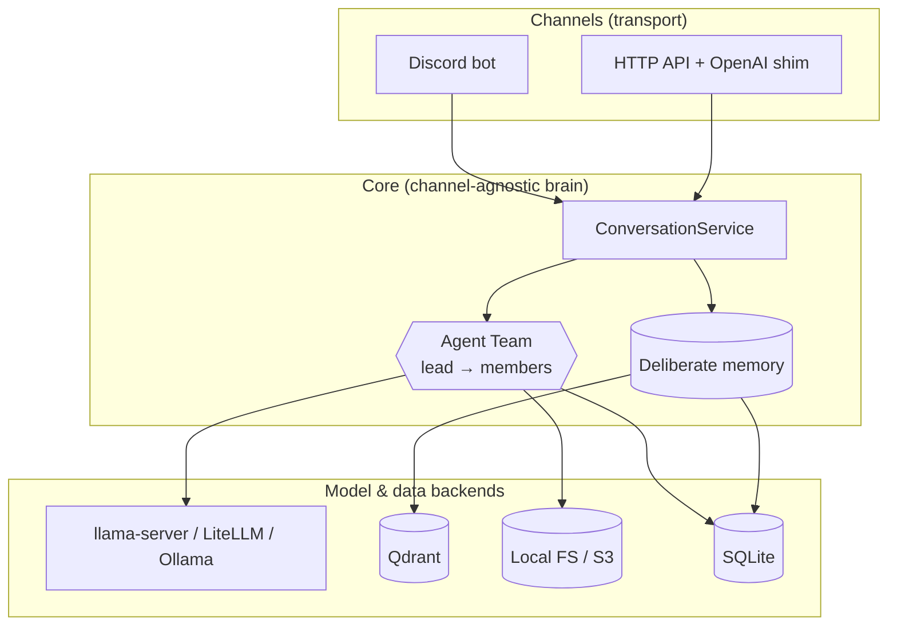

# magi documentation

**magi** is a personal AI-assistant *core*: one shared agent brain — a lead model
that routes to a team of specialists — wrapped in deliberate memory, an optional
knowledge corpus, a durable byte archive, and a model-agnostic backend. The same
brain is served over many channels (a Discord bot, an HTTP API, an
OpenAI-compatible shim). It is built to be the engine a private *persona* (e.g.
`alyssa`) installs and extends without forking.

> The name nods to *Neon Genesis Evangelion*'s MAGI supercomputer — three linked
> units reasoning as one. Here: one shared brain backed by a roster of specialists,
> speaking through many channels.

## Start here

| If you want to… | Read |
|---|---|
| Install and run it for the first time | [getting-started.md](getting-started.md) |
| Understand the design and the request lifecycle | [architecture.md](architecture.md) |
| Learn how memory works (the heart of the project) | [memory.md](memory.md) |
| Wire up Discord / HTTP / a chat UI | [channels.md](channels.md) |
| See every config knob | [configuration.md](configuration.md) |
| Understand the team, members, and tools | [agent-and-tools.md](agent-and-tools.md) |
| Stand up the supporting services (Docker) | [infrastructure.md](infrastructure.md) |

## The shape of it, in one diagram

## Project conventions

- **Source layout.** Single src-layout package under [`src/magi`](../src/magi):
  `core/` (model-free mechanism), `agent/` (model-bound brain + tools),
  `channels/` (transports). See [architecture.md](architecture.md).
- **Domain language.** Memory terminology is defined once in
  [`CONTEXT.md`](../CONTEXT.md); architecture decisions live in
  [`docs/adr/`](adr/).
- **Open-source split.** The public/private (engine/persona) plan is in
  [`docs/split-plan.md`](split-plan.md).
- **Agent workflows.** Issue tracker and triage conventions are under
  [`docs/agents/`](agents/) (see [`AGENTS.md`](../AGENTS.md)).
