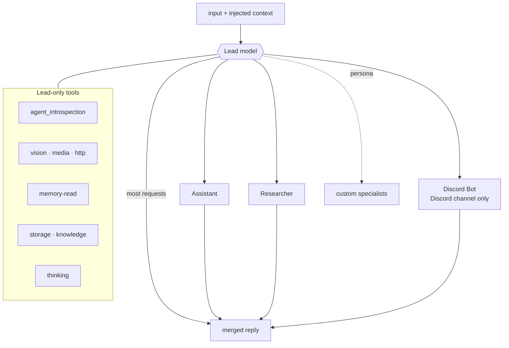

# Agent, team & tools

This document covers the team structure, the member roster, the tool catalog, and
how a persona extends both.

## The team

[`build_team`](../src/magi/agent/team.py) assembles a multimodal **lead** that
routes to **specialist members**. The lead reads each member's `role`, delegates
when a task needs separate expertise, and merges the result into one reply in its
own voice. It is a drop-in for a single `Agent`.



Notable team settings (see the source for the full reasoning):

- `add_history_to_context=False`, `update_memory_on_run=False` — agno's automatic
  history-stuffing and memory extraction are off; magi injects memory deliberately.
- `add_member_tools_to_context=True` — each member's tool names appear in the lead's
  `<team_members>` block so routing matches real capability, not just prose.
- `tool_call_limit` bounds runaway delegation loops.
- A `tool_call_hook` logs every member/tool call (args/timing/result) and turns a
  raising tool into a lead-visible error instead of aborting the run. It is attached
  to every member too (agno copies team hooks only onto team-level tools).

## The lead prompt

The lead's instructions are its **soul** followed by its **operating manual**:

- [`prompts/team/SOUL.md`](../src/magi/prompts/team/SOUL.md) — who the assistant is
  (a neutral demo persona ships; a persona overlay replaces it).
- [`prompts/team/lead.md`](../src/magi/prompts/team/lead.md) — hard operating rules
  (ground every claim in a source, match the tool to the action, mutations only
  from the user, never claim a step succeeded if it didn't), routing, formatting,
  media discipline, and how memory is used.

## Members

The roster is an ordered registry,
[`MEMBER_BUILDERS`](../src/magi/agent/members/__init__.py). Each member is a
`build_<name>(model)` factory.

| Member | Role | Tools |
|---|---|---|
| **Assistant** | Everyday conversation | `enabled_tools()` (time + http) |
| **Researcher** | Fact lookup / research | `enabled_tools()` (time + http) |
| **Discord Bot** | Actions inside the live Discord conversation | `DISCORD_TOOLS` |
| Docker | Containers/images (opt-in, not in the default list) | `DockerTools` |

The API channel drops the Discord member (no live Discord conversation there).

### Adding a member (persona extension)

A persona registers its own specialists at startup — **no edit to the engine tree**:

```python
from magi.agent.members import register_member
from agno.agent import Agent

@register_member
def build_my_specialist(model):
    return Agent(name="My Specialist", role="…when to route here…",
                 model=model, tools=[...])
```

Call `register_member(...)` at the entrypoint *before* `build_team()` reads the
list. It is idempotent (re-registering the same builder is a no-op).

## Tool catalog

A tool is a plain function decorated with `@tool` whose docstring is its contract.
Tools return a structured `ToolOutput` envelope ([`outputs.py`](../src/magi/agent/tools/outputs.py))
with `ok(...)` / `fail(...)`.

### Wired into the lead by default

| Tool(s) | Module | Purpose |
|---|---|---|
| `agent_introspection` | [team.py](../src/magi/agent/team.py) | Lead inspects its own roster before routing |
| `view_image_from_url` | [vision.py](../src/magi/agent/tools/vision.py) | Pull an image into context to actually look at it |
| `send_media_from_url` | [media.py](../src/magi/agent/tools/media.py) | Deliver a URL's bytes to the user as an attachment |
| `http_get`, `http_request` | [http.py](../src/magi/agent/tools/http.py) | Read a URL / perform an explicit user-described request (SSRF-guarded) |
| `recall_memory`, `recall_episodes` | [memory.py](../src/magi/agent/tools/memory.py) | Read-only deeper memory recall |
| `store_file`, `retrieve_file`, `list_files` | [storage.py](../src/magi/agent/tools/storage.py) | Durable byte archive (only if storage enabled) |
| `search_knowledge` | [knowledge.py](../src/magi/agent/tools/knowledge.py) | Query the global RAG corpus (only if knowledge enabled) |
| `set_thinking`, `get_thinking` | [thinking.py](../src/magi/agent/tools/thinking.py) | Flip the backend's thinking mode at runtime |

### Wired into members by default

| Tool(s) | Module | Notes |
|---|---|---|
| `get_current_time` | [time.py](../src/magi/agent/tools/time.py) | In `DEFAULT_TOOLS` |
| `http_get`, `http_request` | [http.py](../src/magi/agent/tools/http.py) | In `DEFAULT_TOOLS` |
| Discord actions | [discord.py](../src/magi/agent/tools/discord.py) | `DISCORD_TOOLS`, Discord member only |

### Available for persona wiring (not in the default roster)

These are full tool sets shipped with the engine that a persona attaches to its own
members:

| Set | Module | Covers |
|---|---|---|
| `DANBOORU_TOOLS` | [danbooru.py](../src/magi/agent/tools/danbooru.py) | Tag/wiki/artist lookups (offline CSV → live API), Civitai models |
| `SEANIME_TOOLS` | [seanime.py](../src/magi/agent/tools/seanime.py) | Anime/manga library, search, progress (HTTP) |
| Seanime MCP | [seanime_mcp.py](../src/magi/agent/tools/seanime_mcp.py) | Same domain via Seanime's read-only MCP server |
| LiteLLM admin | [litellm.py](../src/magi/agent/tools/litellm.py) | List models / model info / proxy health |
| Ollama admin | [ollama.py](../src/magi/agent/tools/ollama.py) | List/show/running Ollama models |

### Adding a tool

```python
# magi/agent/tools/mytool.py
from agno.tools import tool
from magi.agent.tools.outputs import ToolOutput, ok

@tool(show_result=True)
def my_action(...) -> ToolOutput[...]:
    """One-paragraph contract: WHEN the model should call this and WHAT it does."""
    ...
    return ok("done", ...)
```

Then wire it in — two paths, depending on where you sit:

- **Engine contributor** — import it in
  [`tools/__init__.py`](../src/magi/agent/tools/__init__.py) and add it to
  `DEFAULT_TOOLS` (members), or to the lead's `tools=[...]` list in
  [team.py](../src/magi/agent/team.py). `enabled_tools()` is the single place
  members resolve their tool set, so the default is never duplicated across
  builders.
- **Persona overlay** — register it from outside the engine tree, at your
  entrypoint *before* `build_team()` (the tool twin of `register_member`):

  ```python
  from magi.agent.tools import register_tool, register_lead_toolkit

  register_tool(my_action)          # joins DEFAULT_TOOLS → every member

  @register_lead_toolkit            # lead-level, dependency-injected
  def build_my_tools(memory):       # receives the team's MemoryManager
      return [my_action]
  ```

  Both are idempotent (safe under a re-imported entrypoint). Lead toolkit
  builders follow the engine's own `build_*_tools(memory)` convention; a
  raising builder is skipped with a warning instead of aborting team build.

### Skills — prompt + tools + gate as one unit

When a capability needs the model to *know* something as well as *do*
something, register a **skill** instead of wiring a prompt fragment and tools
separately ([`skills.py`](../src/magi/agent/skills.py)):

```python
from magi.agent.skills import Skill, register_skill

register_skill(Skill(
    name="dice",                       # slug; prompt resolves at skills/dice.md
    prompt="Roll dice via roll_dice…", # inline default fragment
    tools=(roll_dice,),                # lead tools
    lead_toolkit=build_dice_tools,     # optional, memory-injected
    member_tools=(),                   # optional, joins the member default set
    enabled=lambda: config.dice_on,    # gate, evaluated at team build
))
```

At team build each active skill's prompt fragment is appended (labeled) to the
lead's instructions and its tools attached. The prompt is overlay-aware: a
file at `skills/<name>.md` (runtime overlay > persona dir > bundled) wins over
the inline default — the seam self-evolution enhances. A disabled or raising
skill degrades to "not attached"; the bot always boots. Runnable demo:
[`examples/custom_skill.py`](../examples/custom_skill.py).

## Memory tools

Durable memory is written by the **curator** (see [memory.md](memory.md#the-curator--who-writes-durable-memory)),
not the lead. The lead keeps only read tools (`recall_memory`, `recall_episodes`)
for explicit deeper lookups — and rarely needs them, since the current profile,
episodes, and window are already injected into every run by `build_context`. They
are bound to an injected `MemoryManager` (no globals); the channel sets the scope
before each run, so the model calls them with no arguments.
