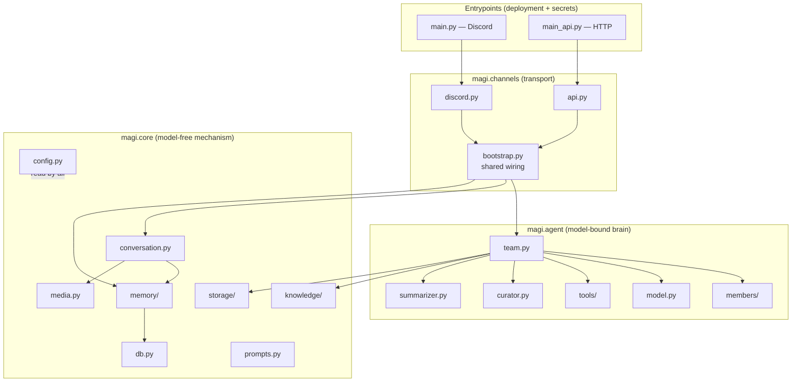
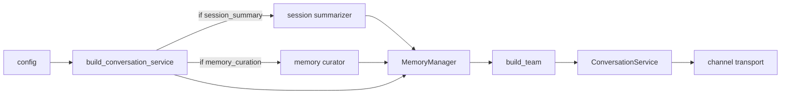
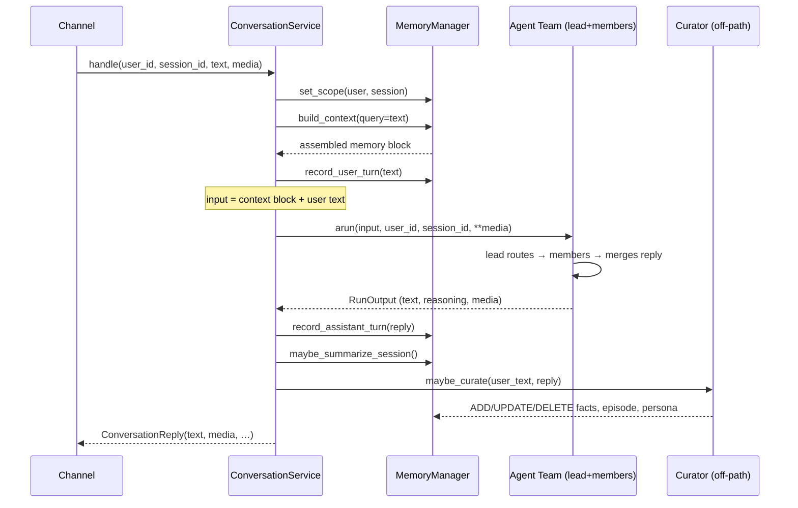
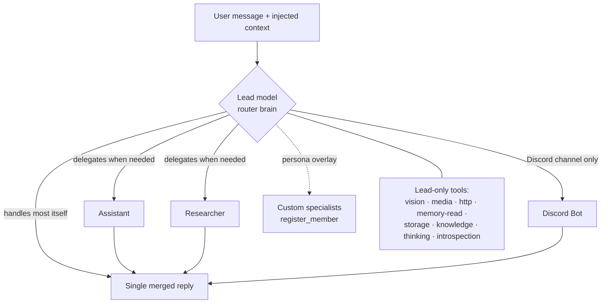
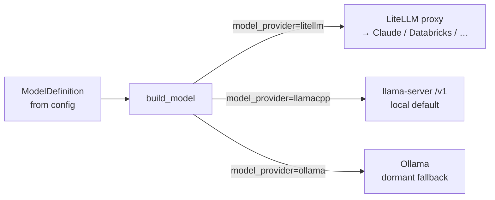

# Architecture

## Main goal

magi is the **reusable core of a personal AI assistant**. It is not a single bot;
it is the engine that several bots share:

- **One shared brain, many channels.** A Discord bot, an HTTP service, and an
  OpenAI-compatible shim all drive the *same* assembled stack. Only the transport
  differs — the conversation logic, memory, team, and tools are wired once.
- **Deliberate memory, not framework magic.** The model's long-term knowledge of
  a user lives in durable, inspectable files that are written *on purpose* (by a
  post-turn curator), never silently auto-extracted. You can open them and read
  what the assistant remembers.
- **Model-agnostic.** A local `llama.cpp` `llama-server` is the default chat
  backend; Claude (via a LiteLLM proxy) and Ollama are drop-in alternatives — the
  team code never names a provider.
- **Engine + persona.** The public engine boots and chats with a neutral demo
  persona. A private persona repo (e.g. `alyssa`) overlays prompts and registers
  its own specialists *without editing the engine tree*. See
  [split-plan.md](split-plan.md).

## Design principles

| Principle | How it shows up in the code |
|---|---|
| **`core/` is model-free** | [`magi/core`](../src/magi/core) never imports a model. Anything needing an LLM (summarizers, the curator) is injected as a callable by the agent layer. |
| **Dependency injection, no globals** | The team, memory manager, and DB are constructed at composition roots and passed in. Scope flows through a `ContextVar`, never as a tool argument. |
| **Code-first config** | All settings are plain Python set at the entrypoint via `configure(...)`. Only *secrets* come from `.env`. See [configuration.md](configuration.md). |
| **Graceful degradation** | Optional features (storage, knowledge, semantic search, MCP) degrade to "tool not attached" when their backend is missing or down. The bot always boots. |
| **Pluggable extension points** | Members are a registry (`register_member`), prompts are an overlay (`load_prompt`), tools are a list. A persona extends all three from the outside. |

## Layered package map



Dependency direction is strictly **downward**: channels depend on agent + core;
agent depends on core; core depends on nothing above it. `core` stays
model-free — the curator and summarizers live in `agent/` precisely because they
need a model, and they are handed to `core` as injected callables.

## Composition: how the stack is built

Every channel calls one shared assembler,
[`build_conversation_service`](../src/magi/channels/bootstrap.py), in a fixed order:

```
summarizers (gated by config) → memory → team(memory, members) →
ConversationService(team, memory, channel_guidance)
```



Each channel then adds only its transport-specific pieces: Discord adds a
`discord.Client` and the Discord output-guidance prompt; the API adds the FastAPI
app, auth, CORS, and any MCP lifespan.

## The request lifecycle

[`ConversationService`](../src/magi/core/conversation.py) owns the run + memory
flow for one inbound message, free of any channel concern. Both the whole-reply
(`handle`) and streaming (`handle_stream`) paths share the same head (prepare
input) and tail (finish turn).



Key invariants:

- **Context rides inside the run input**, never on the shared runner. Mutating
  `runner.additional_context` would race concurrent conversations — one user could
  see another's memory.
- **Scope is set once per message** (`set_scope`) and read by tools via a
  `ContextVar`. The `MemoryManager` is a single shared instance, so `mem` is
  resolved per-access, never cached (see [ADR 0001](adr/0001-per-kind-memory-modules.md)).
- **Memory is folded/curated once per turn**, from the final text — identical for
  streaming and non-streaming.
- **Failures never hand the channel silence.** A run that errors returns an honest
  error reply; a run that completes empty returns a fallback. Curation failures are
  swallowed — they must never break a chat.

## The agent team

A [`Team`](../src/magi/agent/team.py) is a lead model that reads each member's
`role`, routes the message to the right specialist (or coordinates several), then
merges their work into one reply in its own voice.



- The **lead** is multimodal and tool-equipped; it answers most requests directly
  and delegates only when a task needs separate expertise.
- **Members** are built from `MEMBER_BUILDERS` (assistant, researcher, Discord
  helper by default). A persona appends its own with `register_member(builder)`.
- agno's automatic history-stuffing and memory extraction are **turned off**
  (`add_history_to_context=False`, `update_memory_on_run=False`) — magi injects its
  own memory deliberately.
- Robustness: a `tool_call_limit` bounds runaway delegation loops; a tool hook logs
  every member/tool call and converts a raising tool into a lead-visible error
  instead of aborting the run.

See [agent-and-tools.md](agent-and-tools.md) for the full member and tool roster.

## Model backends

[`magi/agent/model.py`](../src/magi/agent/model.py) is the single place that turns
a declarative `ModelDefinition` (id, capabilities, context window) into a concrete
agno `Model`, dispatching per provider.



- **`llamacpp`** (default deployment) talks directly to a `llama-server`
  OpenAI-compatible `/v1`. The context window is fixed at launch (`--ctx-size`);
  `lead_num_ctx`/`member_num_ctx` are budgets for context assembly only and must
  match it. Sampling overrides ride per-request via `extra_body`.
- **`litellm`** routes through a LiteLLM proxy (a `litellm_proxy/` prefix tells the
  SDK to use `api_base`). A small `ProxyLiteLLM` subclass normalizes no-argument
  tool calls some proxied backends emit.
- **`ollama`** is a dormant local fallback.

Add a provider by extending `ModelProviderEnum`, writing a `_build_<provider>`,
and registering it in `_BUILDERS`.

## Where to go next

- The memory subsystem — the project's centerpiece — has its own deep dive:
  [memory.md](memory.md).
- Channel contracts (endpoints, SSE, media, the OpenAI shim): [channels.md](channels.md).
- Every configuration field: [configuration.md](configuration.md).
