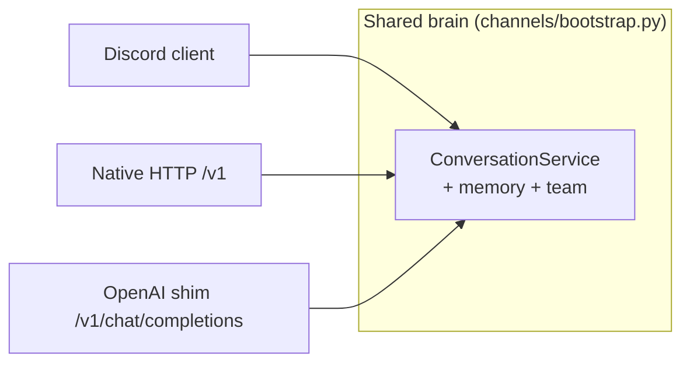
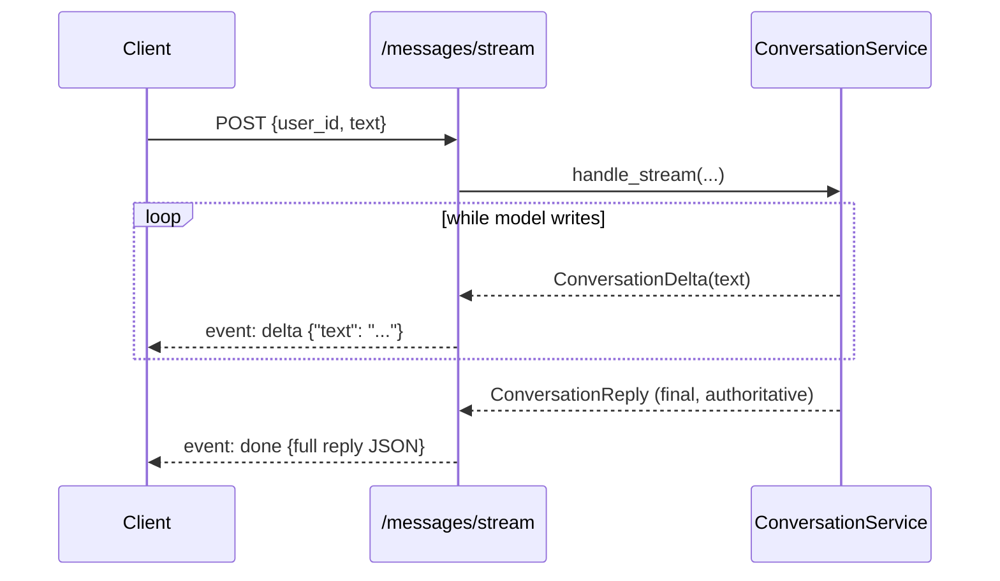
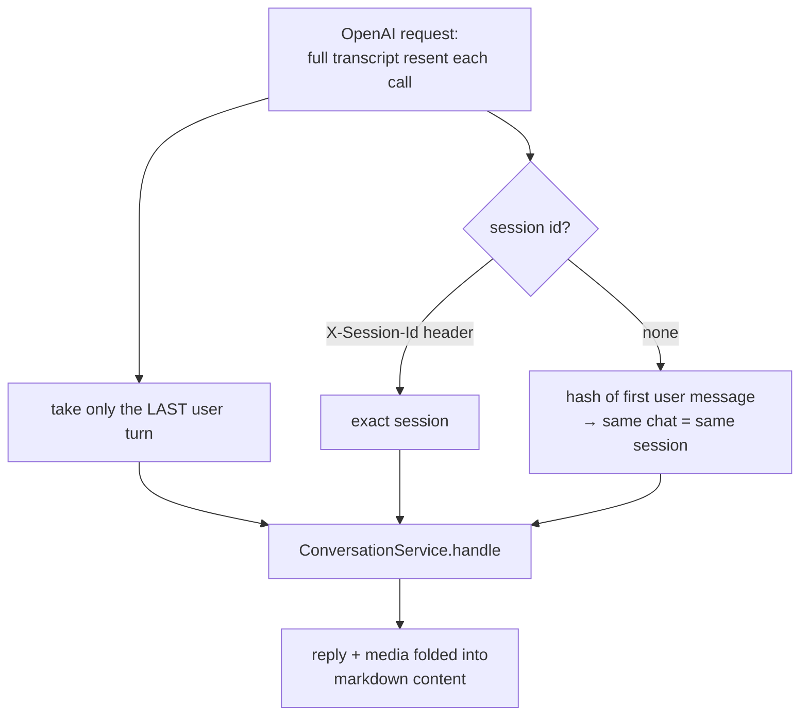
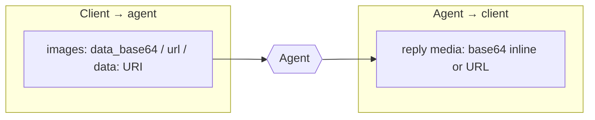

# Channels

A **channel** is a transport over the shared brain. Every channel builds the same
[`ConversationService`](../src/magi/core/conversation.py) via
[`build_conversation_service`](../src/magi/channels/bootstrap.py) and adds only its
own wire format. Two ship today: Discord and the HTTP API (which also exposes an
OpenAI-compatible shim).



The client owns the ids: **`user_id`** scopes memory (durable per person),
**`session_id`** scopes one conversation.

## Gateway and platform adapters

Each channel's presentation layer (`DiscordClient`, the API's route handlers)
is a **platform adapter**: it normalizes one transport's native events into
calls against `ConversationService` and renders replies back out in that
transport's format. [`magi/channels/gateway.py`](../src/magi/channels/gateway.py)
formalizes the seam every adapter plugs into (see
[ADR 0003](adr/0003-gateway-and-platform-adapters.md)):

- **`PlatformAdapter`** — the minimal structural contract (a `platform` name +
  `serve_async()`) both `DiscordClient` and the API's `ApiAdapter` satisfy.
- **`scoped_user_id(platform, external_id)`** — every adapter derives its
  `user_id` through this (`f"{platform}:{external_id}"`, e.g. `discord:123`,
  `api:u1`) before calling `ConversationService`, so two platforms whose
  native ids happen to collide never silently share one user's memory.
- **`run_gateway(*coros)`** — runs several long-lived service coroutines (an
  adapter's `serve_async()`, an admin uvicorn server) concurrently in one
  process; the first to finish or raise takes the rest down with it. Backs
  `serve_with_admin` (`config.admin_enabled`).

## Discord bot

```bash
python main.py          # needs DISCORD_BOT_TOKEN in .env
```

[`build_discord_client`](../src/magi/channels/discord.py) wires the shared brain
with Discord-only output guidance ([`prompts/channels/discord.md`](../src/magi/prompts/channels/discord.md))
and a `discord.Client`. Inbound audio is only forwarded to runs when the lead can
actually hear it (vision-only backends reject `input_audio` parts). The Discord
specialist member (`build_discord_agent`) acts inside the current live conversation.

## HTTP API

```bash
python main.py api      # standalone HTTP service; binds 127.0.0.1:8000 by default
```

The native contract ([`magi/channels/api.py`](../src/magi/channels/api.py)) is
small and session-scoped, mirroring `ConversationService` one-to-one:

| Method & path | Body / query | Purpose |
|---|---|---|
| `GET /healthz` | — | Liveness probe (no auth) |
| `POST /v1/sessions/{session_id}/messages` | `{user_id, text, images?}` | Run one turn, return the whole reply |
| `POST /v1/sessions/{session_id}/messages/stream` | same body | Same turn, streamed over SSE |
| `POST /v1/sessions/{session_id}/flush` | `{user_id}` | Close the session (fold summary → episode, wipe live turns) |
| `GET /v1/sessions/{session_id}/context` | `?user_id=…` | Context size stats |
| `POST /v1/tts` | `{text, mood?}` | Speak text through the TTS sidecar → raw `audio/*` (503 when none wired) |
| `POST /v1/stt` | multipart `file` | Transcribe recorded speech via the STT sidecar → `{text, language?, duration?}` |

The two message endpoints are **interchangeable per request** — same body, same
brain, same memory semantics. Plain JSON returns the whole reply at once; the SSE
variant emits `delta` events (`{"text": chunk}`) while the model writes, then one
terminal `done` event carrying the full reply JSON (authoritative — errors arrive
as `done` with `is_error: true`).



**Auth.** When `API_AUTH_TOKEN` is set, `/v1` requires `Authorization: Bearer
<token>`; `/healthz` stays open. Errors travel *in-band* (`is_error: true`) on a
`200`, not as HTTP errors — the run finished and produced an honest reply to show.

**CORS.** Browser clients are blocked unless the service returns CORS headers. Set
`api_cors_origins` to the allowed web origins (or `["*"]` — safe here, since auth
is a Bearer token, not a cookie).

### Voice (TTS / STT)

`/v1/tts` and `/v1/stt` front the two OpenAI-compatible voice sidecars
([`magi/core/voice.py`](../src/magi/core/voice.py), configured under `tts_*` /
`stt_*` — see [configuration.md](configuration.md#voice-sidecars-tts--stt)) so
browser clients get voice through the same origin + bearer token as chat, never
reaching the sidecars directly. `mood` on `/v1/tts` is the mood the reply rode
in on (the pre-reply pass predicts delivery; `tts_mood_styles` maps it to voice
parameters). Honest failure shape: **503** capability-off/sidecar-down, **502**
sidecar-errored — clients degrade to silent text or hide the mic. The desktop
shell auto-grants microphone capture to its own loopback frontend
(`FramelessWindow._wire_mic_permission`); a plain browser shows its normal mic
prompt.

### OpenAI-compatible shim

The same brain answers OpenAI's chat-completions format, so off-the-shelf chat UIs
(Open WebUI, LibreChat, …) work with no custom code:

| Method & path | Purpose |
|---|---|
| `GET /v1/models` | Advertises one model id, `chatbot` (lets UIs auto-discover it) |
| `POST /v1/chat/completions` | OpenAI chat completions; set `"stream": true` for SSE |

The shim bridges a **stateless wire onto a stateful brain**:



- OpenAI clients resend the whole transcript, but the agent keeps its own session
  memory, so **only the last user message is forwarded** — the rest is carried by
  memory.
- OpenAI carries no session id, so one is derived from a stable hash of the chat's
  first user message (same chat → same server session). Pass `X-Session-Id` (and
  `X-User-Id`) to be exact; the `user` field, when sent, scopes memory.
- Uploaded images (`image_url` `data:` URIs) are forwarded for the agent to see.
  Reply media has no slot in that format, so it is folded back into the message text
  as markdown.

See [getting-started.md](getting-started.md#chat-ui-open-webui) for the Open WebUI
recipe, and the docstring of [`api.py`](../src/magi/channels/api.py) for the full
mapping.

## Media flows both ways



- **Inbound.** Requests may carry images for the agent to see — `images: [{...}]`
  on the native body, or OpenAI `image_url` parts on the shim. Inline bytes
  (base64 / `data:` URIs) are decoded so a local backend with no fetch can see
  them; plain `http(s)` URLs pass by reference. Whether the model actually *sees*
  them depends on the backend having vision (e.g. a llama-server with an mmproj
  loaded).
- **Outbound.** Replies carry the media the agent delivered. Deliverables are
  staged on a per-run **outbox** ContextVar ([`magi/core/media.py`](../src/magi/core/media.py))
  so the bytes never enter the model's context (a vision-only backend chokes on
  audio; a big image burns tokens) — they ride straight to the channel. Images the
  model fetched only to *look at* (`view_image_from_url`) are marked view-only and
  excluded from the reply.

## MCP lifespan (optional)

If a member talks to a server over MCP (e.g. Seanime via `seanime_use_mcp`), the
API app opens that connection at startup and closes it at shutdown via the FastAPI
lifespan, so the session is warm before the first request and the server's tool
names appear in the lead's roster. Best-effort: a connect failure is logged, not
fatal.
