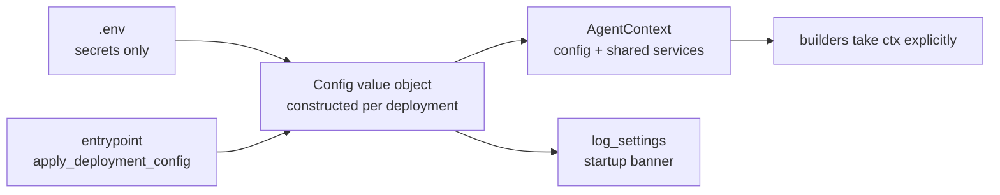

# Configuration

magi is **code-first**. All settings are plain Python on the frozen `Config`
dataclass in [`magi/core/config.py`](../src/magi/core/config.py); each deployment
constructs the one `Config` its entrypoint needs and threads it explicitly through
the build. To learn what a value is, read the entrypoint and that file — there is
no env-var archaeology, and there is no process-global config to hunt for.

Only **secrets** come from the environment / `.env`. The effective values (secrets
masked) are printed at startup by `config.log_settings()` — one banner so you can
confirm what's live.



## How it works

`Config` is a **frozen value object**. A deployment builds one directly and returns
it from its entrypoint; nothing is mutated in place, and there is no shared
singleton.

```python
# in main.py / main_api.py
from magi.core.config import Config

def apply_deployment_config() -> Config:
    return Config(
        model_provider="llamacpp",
        llamacpp_base_url="http://127.0.0.1:8888/v1",
        session_summary=True,
        memory_curation=True,
        # …
    )
```

- Because `Config` is frozen, you never edit one in place. To vary an existing
  config immutably, use `dataclasses.replace` — this is exactly how the container
  entrypoints overlay their deltas:

  ```python
  import dataclasses
  cfg = dataclasses.replace(apply_deployment_config(), api_host="0.0.0.0")
  ```

- The config is threaded explicitly via an [`AgentContext`](../src/magi/core/context.py)
  — a dataclass holding the `config` plus lazily-built shared services (currently
  the `db`). Construct one with `AgentContext(config=cfg)`; the composition roots
  (`build_conversation_service(ctx, …)`, `build_team(ctx, …)`, `build_api_app(ctx)`,
  …) take `ctx` rather than reaching for a global.
- The simplest way to build the whole stack is the top-level factory, which wraps
  all of the above:

  ```python
  from magi import Assistant, Config

  assistant = Assistant.create(Config(model_provider="llamacpp", lead_model_id="qwen3.5-9b"))
  ```

- **Instance-scoped config, no global.** Because everything hangs off the `Config`
  carried in its own `AgentContext`, multiple assistants with different configs can
  coexist in one process — nothing is read from or written to a shared global.

## Secrets (`.env` only)

These never belong in code. See [`.env.example`](../.env.example).

| Variable | Used for |
|---|---|
| `DISCORD_BOT_TOKEN` | Discord bot auth |
| `LITELLM_MASTER_KEY` | LiteLLM proxy auth |
| `LLAMACPP_API_KEY` | Only if `llama-server` runs with `--api-key` |
| `OPENAI_API_KEY` | Remote OpenAI-compatible serving (`model_provider="openai"` / `embeddings_provider="openai"`) |
| `QDRANT_API_KEY` | Qdrant auth (semantic memory / knowledge / item archive) |
| `API_AUTH_TOKEN` | Gates `/v1` with `Authorization: Bearer <token>` |
| `S3_ACCESS_KEY_ID`, `S3_SECRET_ACCESS_KEY` | S3-backend object storage |
| `SEANIME_TOKEN` | Seanime server password (sent as `X-Seanime-Token`) |

## Settings reference

Defaults shown are the engine defaults; the bundled entrypoints override several
(notably `model_provider="llamacpp"`, `session_summary=True`, `memory_curation=True`).

### Model backends

| Field | Default | Notes |
|---|---|---|
| `model_provider` | `"litellm"` | `litellm` \| `llamacpp` \| `openai` \| `ollama` |
| `litellm_base_url` | `http://localhost:4000` | LiteLLM proxy gateway |
| `llamacpp_base_url` | `http://localhost:8080/v1` | Direct llama-server `/v1` |
| `openai_base_url` | `https://api.openai.com/v1` | Remote OpenAI-compatible server (`model_provider="openai"`) — OpenAI, OpenRouter, Together, a remote vLLM/llama-server, … |
| `ollama_host` | `http://localhost:11434` | Dormant fallback |
| `lead_model_id` | `qwen3.5-9b-llamacpp` | Lead/router brain id |
| `member_model_id` | `qwen3.5-9b-llamacpp` | Specialist member id |
| `lead_num_ctx` | `128000` | Context budget for assembly — **keep == llama-server `--ctx-size`** |
| `member_num_ctx` | `128000` | Same, for members |
| `model_temperature` | `None` | `None` = defer to backend launch flags |
| `model_extra_body` | `{}` | Extra request-body params (e.g. `chat_template_kwargs`, native sampling) |

> **`num_ctx` is a budget, not a runtime knob** for llama-server: the real window
> is fixed at launch and never transmitted per-request. Keep these equal to
> `--ctx-size`. (It *was* an Ollama runtime option.)

### Agent behavior

| Field | Default | Notes |
|---|---|---|
| `system_prompt` | `prompts/system.md` | Single-agent default brain |
| `tool_call_limit` | `12` | Hard cap on tool calls per run (bounds delegation loops); `None`/`0` = no limit |
| `http_allow_private_hosts` | `False` | SSRF guard — block loopback/private hosts unless explicitly opened |
| `ctx_warn_ratio` | `0.75` | Warn when assembled context crosses this fraction of the window |

### Persistence

| Field | Default | Notes |
|---|---|---|
| `db_file` | `data/chatbot.db` | SQLite — agno sessions + team state |
| `memory_dir` | `data/memory` | Deliberate-memory files root |

### Short-term session memory

| Field | Default | Notes |
|---|---|---|
| `short_term_max` | `20` | Turns kept in the live window |
| `short_term_turn_max_chars` | `4000` | Per-turn size guard (`<= 0` disables) |
| `session_summary` | `False` | Fold evicted turns into a rolling summary |
| `summarize_every` | `10` | Evicted turns per summary |
| `session_pending_max` | `30` | Cap on the pending buffer (oldest dropped) |
| `session_summary_max_chars` | `4000` | Clamp on the summary blob |

### Long-term memory & curator

| Field | Default | Notes |
|---|---|---|
| `memory_curation` | `False` | Post-turn curator owns the durable profile |
| `long_term_recent_raw` | `5` | Raw facts kept alongside the curated profile |
| `long_term_fact_max_chars` | `1000` | Per-fact size clamp (`<= 0` disables) |
| `long_term_facts_max` | `200` | Soft cap on durable facts (oldest dropped) |
| `persona_seed` | `""` | Pre-populate the persona adjustments file |

### Semantic memory search (optional)

Needs the `semantic` extra (`uv sync --extra semantic`) and an embedding backend.

| Field | Default | Notes |
|---|---|---|
| `semantic_memory` | `False` | Retrieve top-k relevant entries instead of whole files |
| `embedding_model_id` | `nomic-embed-text` | Embedding model id |
| `embeddings_provider` | `"litellm"` | Where embeddings are served: `litellm` (proxy) \| `openai` (remote OpenAI-compatible at `openai_base_url`). Lets you serve chat locally and embeddings remotely |
| `qdrant_url` | `http://localhost:6333` | Qdrant endpoint |
| `semantic_top_k` | `5` | Entries retrieved per kind |

### Knowledge layer (RAG)

Global read-only document corpus, separate from memory. See [memory.md](memory.md#memory-vs-knowledge).

| Field | Default | Notes |
|---|---|---|
| `knowledge_enabled` | `False` | Attach the `search_knowledge` tool |
| `knowledge_collection` | `chatbot_knowledge` | Qdrant collection (separate from semantic memory) |
| `knowledge_top_k` | `5` | Chunks retrieved per query |
| `knowledge_chunk_chars` | `1200` | Target chunk size before overlap |
| `knowledge_chunk_overlap` | `150` | Chars repeated between adjacent chunks |

### Object storage (durable byte archive)

The model's "memory for bytes". See [getting-started.md](getting-started.md#object-storage)
and the README. Two backends via `storage_backend`.

| Field | Default | Notes |
|---|---|---|
| `storage_enabled` | `False` | Attach `store_file` / `retrieve_file` / `list_files` |
| `storage_backend` | `"local"` | `local` (filesystem) \| `s3` (S3-compatible) |
| `storage_local_dir` | `data/artifacts` | Where local bytes land |
| `s3_endpoint_url` | `http://localhost:9000` | RustFS/MinIO; `None` = real AWS S3 |
| `s3_region` | `us-east-1` | |
| `s3_bucket` | `chatbot-memory` | |
| `s3_presign_expiry` | `3600` | Lifetime (s) of presigned recall URLs |

> The `s3` backend needs the `s3` extra (`uv sync --extra s3`; boto3 is
> lazy-imported, absent → tools off). Select it with `storage_enabled=True` +
> `storage_backend="s3"`.

### Item archive (durable original + index)

The "persist original + index" hook shared by the admin-managed **items** —
knowledge documents, durable memory facts, and stored files. On a write it keeps
the item's canonical bytes in the object store (the source of truth, re-indexable)
**and** a searchable vector in a Qdrant collection; on delete it drops both. It
pairs the object-store backend (`storage_backend` + the `s3_*` / `storage_local_dir`
fields above) with Qdrant (`qdrant_url`), but is gated by its **own** flag —
independent of `storage_enabled` and `semantic_memory` — so you can turn durable
item archival on without enabling the model's file tools or semantic recall.

| Field | Default | Notes |
|---|---|---|
| `items_archive_enabled` | `False` | Turn the hook on across all three item kinds |
| `items_collection` | `chatbot_items` | Qdrant collection for the cross-item search index |

What it adds per kind (all no-ops when off, and degrade cleanly when the object
store / Qdrant is unreachable — an item write never breaks a chat or an ingest):

- **Knowledge** — keeps the verbatim source document as a re-indexable blob;
  `KnowledgeStore.reindex_document(doc_id)` re-chunks from it (e.g. after a chunk-size
  change) with no source file on hand; deletes cascade to the blob + doc vector.
- **Memory** — snapshots the curated fact sheet (`long_term_facts.json`) to the object
  store after each curator/admin fact write, as an off-disk source-of-truth copy.
- **Files** — indexes each archived file's name + note so the model gets a
  `search_files` tool (find a kept file by description, then recall it).

> Needs Qdrant reachable (the `semantic` extra for `qdrant-client`) for the vector
> side, and — for the `s3` object-store backend — the `s3` extra. The blob side
> works on the zero-setup `local` backend with neither.

### Anime specialist (Seanime)

| Field | Default | Notes |
|---|---|---|
| `seanime_base_url` | `http://127.0.0.1:43211` | Fixed host (no SSRF guard — the model never picks it) |
| `seanime_use_mcp` | `False` | `True` = build the anime member from Seanime's read-only MCP server (needs `mcp` extra) |
| `seanime_mcp_url` | `http://127.0.0.1:43211/api/v1/mcp` | MCP Streamable-HTTP endpoint |

### Discord & HTTP API

| Field | Default | Notes |
|---|---|---|
| `api_host` | `127.0.0.1` | Bind `0.0.0.0` only behind a trusted proxy + with `API_AUTH_TOKEN` set |
| `api_port` | `8000` | |
| `api_cors_origins` | `[]` | Web origins allowed to call `/v1`; `["*"]` is safe (Bearer auth, not cookie) |

### Local Danbooru data (optional, persona tools)

| Field | Default | Notes |
|---|---|---|
| `danbooru_tags_csv` | `artifacts/danbooru_tags.csv` | Offline tag lookups before the live site; missing file is fine |
| `danbooru_wiki_csv` | `artifacts/danbooru_wiki_pages.csv` | Offline wiki lookups |

## Optional extras (`pyproject.toml`)

The base install stays lean; opt into features with extras:

| Extra | Enables | Install |
|---|---|---|
| `semantic` | Qdrant-backed semantic memory search | `uv sync --extra semantic` |
| `s3` | S3-compatible object storage | `uv sync --extra s3` |
| `mcp` | Seanime-over-MCP anime specialist | `uv sync --extra mcp` |

Each is lazy-imported and the relevant feature no-ops when its package is absent.
