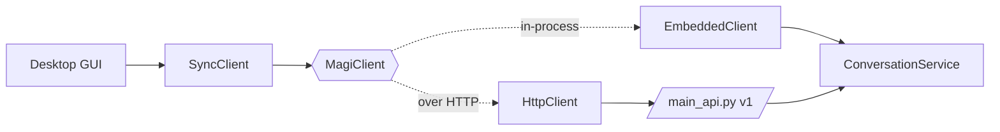

# Desktop apps (GUI)

[`magi.client`](../src/magi/client/__init__.py) is the front door for a desktop
GUI. It gives one ergonomic surface — [`MagiClient`](../src/magi/client/base.py) —
with **two interchangeable backends**, so the GUI codes against the same calls
whether the brain runs in-process or behind an HTTP server:

- **`EmbeddedClient`** — the whole assistant embedded *in the GUI's own process*.
  No port to bind, no server to run alongside. Best when the GUI is Python
  (PyQt/PySide, Flet, Toga, Tkinter).
- **`HttpClient`** — a typed client for a running `python main_api.py` (the v1
  contract in [channels.md](channels.md)). Best when the GUI is a separate
  process (Electron/Tauri/native) or when the brain lives on another host.

Both bind `user_id` + `session_id` at construction (a desktop app is naturally
one client per window/session), and both namespace `user_id` under the **same**
platform — so the *same* `user_id` reaches the *same* durable memory either way.
An app can start embedded and later split to a server (or the reverse) without
touching a single call site.



## Two composition roots

```python
from magi.client import embed, connect

# In-process: wire the full brain from config (code-first — pass overrides
# straight through; they apply via configure() before anything is built).
client = embed(
    user_id="local",
    model_provider="llamacpp",
    llamacpp_base_url="http://127.0.0.1:8888/v1",
)

# Remote: talk to a running service. auth_token is its API_AUTH_TOKEN, if set.
client = connect("http://127.0.0.1:8000", user_id="local", auth_token=None)
```

Either object is a `MagiClient`. The async surface is there directly:

```python
await client.aopen()                          # ready transports / warm MCP
reply = await client.send("hello")            # -> Reply(text, reasoning, media, is_error)
async for chunk in client.stream("more…"):    # Delta per chunk, then one final Reply
    ...
dropped = await client.flush()                # close the session
stats = await client.context_stats()
await client.aclose()
```

## GUI toolkits: `SyncClient`

Tkinter, PyQt/PySide and wx own the main thread with their own event loop, so
`asyncio.run()` on the main thread is awkward and blocking the UI thread freezes
the window. [`SyncClient`](../src/magi/client/sync.py) wraps any `MagiClient`,
runs one asyncio loop on a private daemon thread, and exposes plain blocking
methods:

```python
from magi.client import SyncClient, embed

ui = SyncClient(embed(user_id="local"))       # or connect(...)
print(ui.send("hello").text)
for chunk in ui.stream("tell me more"):       # ordinary generator
    ...
ui.close()                                    # or: with SyncClient(...) as ui: ...
```

Call `send`/`stream` from a **worker thread** so the UI thread stays responsive,
and marshal results back to the UI thread with the toolkit's own mechanism
(`root.after`, Qt signals, …). Calling from the UI thread also works — it just
blocks until the turn finishes.

## Plain, dependency-light types

The GUI only ever sees stdlib dataclasses from
[`magi.client.types`](../src/magi/client/types.py) — never agno media objects or
the FastAPI wire models:

- **`Reply`** — `text`, `reasoning`, `is_error`, `media`.
- **`Media`** — `kind` (`image`/`video`/`audio`/`file`), `mime_type`, `filename`,
  and exactly one of `url` (by reference) / `data` (inline bytes). `.data_uri`
  renders inline bytes for an ``.
- **`Delta`** — one streamed text chunk.
- **`InboundImage`** — an image to send the agent (`data` bytes or an http `url`).

## Runnable example

[`examples/desktop_chat.py`](../examples/desktop_chat.py) is a ~150-line Tkinter
chat window (Tkinter ships with CPython — no extra dependency) that puts it all
together: one `SyncClient`, turns on a worker thread, streamed deltas marshalled
back to the UI.

```bash
# Against a running service:
python examples/desktop_chat.py --http http://127.0.0.1:8000

# Or fully embedded (needs a model backend reachable, e.g. local llama-server):
python examples/desktop_chat.py --embedded \
    --model-provider llamacpp --llamacpp-url http://127.0.0.1:8888/v1
```

You need a model backend somewhere either way — the example demonstrates the
client surface, not a bundled model.
