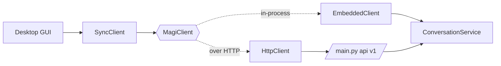

# Desktop apps (GUI)

[`magi.client`](../src/magi/client/__init__.py) is the front door for a desktop
GUI. It gives one ergonomic surface — [`MagiClient`](../src/magi/client/base.py) —
with **two interchangeable backends**, so the GUI codes against the same calls
whether the brain runs in-process or behind an HTTP server:

- **`EmbeddedClient`** — the whole assistant embedded *in the GUI's own process*.
  No port to bind, no server to run alongside. Best when the GUI is Python
  (PyQt/PySide, Flet, Toga, Tkinter).
- **`HttpClient`** — a typed client for a running `python main.py api` (the v1
  contract in [channels.md](channels.md)). Best when the GUI is a separate
  process (Electron/Tauri/native) or when the brain lives on another host.

Both bind `user_id` + `session_id` at construction (a desktop app is naturally
one client per window/session), and both namespace `user_id` under the **same**
platform — so the *same* `user_id` reaches the *same* durable memory either way.
An app can start embedded and later split to a server (or the reverse) without
touching a single call site.



## Two composition roots

```python
from magi.client import embed, connect

# In-process: wire the full brain from config (code-first — pass overrides
# straight through; they apply via configure() before anything is built).
client = embed(
    user_id="local",
    model_provider="llamacpp",
    llamacpp_base_url="http://127.0.0.1:8888/v1",
)

# Remote: talk to a running service. auth_token is its API_AUTH_TOKEN, if set.
client = connect("http://127.0.0.1:8000", user_id="local", auth_token=None)
```

Either object is a `MagiClient`. The async surface is there directly:

```python
await client.aopen()                          # ready transports / warm MCP
reply = await client.send("hello")            # -> Reply(text, reasoning, media, is_error)
async for chunk in client.stream("more…"):    # Delta per chunk, then one final Reply
    ...
dropped = await client.flush()                # close the session
stats = await client.context_stats()
await client.aclose()
```

## GUI toolkits: `SyncClient`

Tkinter, PyQt/PySide and wx own the main thread with their own event loop, so
`asyncio.run()` on the main thread is awkward and blocking the UI thread freezes
the window. [`SyncClient`](../src/magi/client/sync.py) wraps any `MagiClient`,
runs one asyncio loop on a private daemon thread, and exposes plain blocking
methods:

```python
from magi.client import SyncClient, embed

ui = SyncClient(embed(user_id="local"))       # or connect(...)
print(ui.send("hello").text)
for chunk in ui.stream("tell me more"):       # ordinary generator
    ...
ui.close()                                    # or: with SyncClient(...) as ui: ...
```

Call `send`/`stream` from a **worker thread** so the UI thread stays responsive,
and marshal results back to the UI thread with the toolkit's own mechanism
(`root.after`, Qt signals, …). Calling from the UI thread also works — it just
blocks until the turn finishes.

## Plain, dependency-light types

The GUI only ever sees stdlib dataclasses from
[`magi.client.types`](../src/magi/client/types.py) — never agno media objects or
the FastAPI wire models:

- **`Reply`** — `text`, `reasoning`, `is_error`, `media`.
- **`Media`** — `kind` (`image`/`video`/`audio`/`file`), `mime_type`, `filename`,
  and exactly one of `url` (by reference) / `data` (inline bytes). `.data_uri`
  renders inline bytes for an ``.
- **`Delta`** — one streamed text chunk.
- **`InboundImage`** — an image to send the agent (`data` bytes or an http `url`).

## Runnable example

[`examples/desktop_chat.py`](../examples/desktop_chat.py) is a ~150-line Tkinter
chat window (Tkinter ships with CPython — no extra dependency) that puts it all
together: one `SyncClient`, turns on a worker thread, streamed deltas marshalled
back to the UI.

```bash
# Against a running service:
python examples/desktop_chat.py --http http://127.0.0.1:8000

# Or fully embedded (needs a model backend reachable, e.g. local llama-server):
python examples/desktop_chat.py --embedded \
    --model-provider llamacpp --llamacpp-url http://127.0.0.1:8888/v1
```

You need a model backend somewhere either way — the example demonstrates the
client surface, not a bundled model.

---

# Frameless desktop shell (native window over the web frontend)

Everything above is the `magi.client` SDK — for building a GUI *in Python* that
talks to the brain. This section is a different thing: a **frameless, widget-style
native window that renders the existing web frontend** (`web/`, the Next.js admin
+ chat UI) with no browser chrome, launched by one command:

```bash
uv sync --extra desktop        # PySide6 + QtWebEngine (kept optional)
python main.py desktop          # frameless window; --no-frameless for a titled one
```

It lives in [`magi.desktop`](../src/magi/desktop/) with one concern per module:
`backend.py` (the in-process chat+admin API), `server.py` (owns the frontend
process), `bridge.py` (JS↔Python contract), `window.py` (the translucent window +
web view), `app.py` (bootstrap).

**One command, every page live.** The frontend's pages proxy to two Python
services — the chat-api (`/v1/*`: the chat stream + the team page's
`/v1/introspection`) and the admin-api (`/admin/v1/*`: dashboard, memory,
knowledge, subjects, persona). So the shell runs that API **in-process** too: the
shared brain plus `admin_enabled=True` — the single-app shape that serves `/v1/*`
AND `/admin/v1/*` (ADR 0002) — on a loopback ephemeral port it wires the BFF to
(`CHAT_API_URL` + `ADMIN_API_URL`, with matching tokens). The model backend
(llama-server) only needs to be up for actual *chat turns*; the dashboard/memory/
knowledge/subjects pages work regardless. Already running a backend elsewhere
(e.g. `python main.py api` in Docker)? Set `desktop_serve_backend=False` and point
the frontend at it via `CHAT_API_URL` / `ADMIN_API_URL`.

## What it does

- **Serves the frontend from this process, no separate web server.** The shell
  launches the Next.js app as a loopback child it fully owns — reserves a free
  `127.0.0.1` port, binds the child to it (`HOSTNAME=127.0.0.1`), waits until it
  answers, then loads it — and tears the process tree down on quit.

  > **Design note / deviation:** the generic pattern is a lightweight Python HTTP
  > server (or `app://` scheme) serving *static* assets. Our frontend is a Next.js
  > standalone app with server-side route handlers (the BFF) — it **cannot** be
  > statically exported, it needs Node. So "in-process serving" is met by a
  > *managed subprocess* this executable starts and stops: still one command, still
  > loopback-only, still no separately-run server. See [architecture.md](architecture.md).

  Two build layouts are auto-detected: a plain `next build` (dev) is run via
  `next start`; the assembled standalone layout (`server.js` colocated with
  `.next/static` + `public`, i.e. the Docker/frozen image) is run directly.
  Requires a built `web/` (`cd web && npm run build`) — same prerequisite as the
  browser deployment.

- **Frameless, translucent widget window.** `FramelessWindowHint | Tool` (off the
  taskbar/Alt-Tab), `WA_TranslucentBackground` with a rounded semi-transparent
  panel painted behind the web view. No title bar, so it wires its own: **drag**
  from the translucent border (native `startSystemMove`, with a manual fallback),
  **resize from any edge or corner** (native `startSystemResize` + a resize cursor
  on hover, plus a corner `QSizeGrip` and a manual fallback), a small **hide**
  button, a right-click **context menu**, and a **tray icon** (Show / Hide / Quit)
  that also hosts native notifications. Position/size persist across launches via
  `QSettings`.

- **JS ↔ Python bridge** over QWebChannel — see below.

- **Single instance + graceful shutdown.** A second `python main.py desktop`
  detects the running one (via `QLocalServer`/`QLocalSocket`), asks it to surface
  its window, and exits. On quit the Node child is terminated (whole tree), the
  listener released, and geometry saved.

## Auth & environment (the shell supplies web/.env)

The frontend's BFF normally reads its secrets from `web/.env` — which a frozen
build doesn't ship. So the **shell is the single source of truth**: it forwards
every var the BFF needs to the Node child explicitly (`FrontendServer(extra_env=…)`,
which wins over anything inherited), sourced from the Python config
([`core/config.py`](../src/magi/core/config.py), i.e. the root `.env` / real env):

| Var passed to the Node child | Source | Purpose |
| --- | --- | --- |
| `CHAT_API_URL`, `ADMIN_API_URL` | in-process backend URL | where the BFF proxies chat + admin |
| `API_AUTH_TOKEN`, `ADMIN_AUTH_TOKEN` | `config.api_auth_token` / `admin_auth_token` | bearer the BFF presents upstream (only if set) |
| `ADMIN_PASSWORD` | `config.admin_password` | the operator password login checks |
| `SESSION_SECRET` | `config.session_secret` | HMAC key signing the session cookie |

`SESSION_SECRET` is **required** by the frontend (it throws without one), so if it's
unset the shell generates a random key **once** and persists it in `QSettings` —
stable across launches, so your login keeps verifying. `ADMIN_PASSWORD` can't be
invented; set it (root `.env` or the environment) or login can't succeed.

The frontend gates every route behind a session cookie ([web middleware](../web/src/middleware.ts)),
so the first launch lands on `/login` (enter `ADMIN_PASSWORD`). The window uses a
**persistent** QtWebEngine profile, so the cookie survives restarts — you log in
once. `desktop_start_path` (default `/chat`) is where it opens once authenticated.

## The bridge contract

A `NativeBridge` `QObject` is exposed to the page as `window.nativeBridge`. Because
the frontend is a bundle we don't edit, the channel is wired by an **injected**
script (Qt's `qwebchannel.js` + a bootstrap, injected at document-creation) — no
frontend changes required. Contract:

| Direction | Member | Purpose |
| --- | --- | --- |
| JS → Py | `ping()` → `"pong"` | liveness / channel check |
| JS → Py | `getAppInfo()` → JSON string | app + platform + server info |
| JS → Py | `notify(title, body)` | native OS notification (via the tray) |
| JS → Py | `openExternal(url)` → bool | open a URL in the OS browser |
| JS → Py | `hideWindow()` / `closeApp()` | dismiss / quit (no title bar) |
| Py → JS | `messageReceived(str)` signal | Python push (one is emitted on load) |

Any frontend (or a browser-console test) uses it by waiting for the readiness
event the injected bootstrap fires:

```js
// The injected bootstrap sets window.nativeBridge, then dispatches this event.
window.addEventListener("nativebridge:ready", async () => {
  const bridge = window.nativeBridge;

  console.log(await bridge.ping());              // -> "pong"
  console.log(JSON.parse(await bridge.getAppInfo()));

  // Python -> JS push (subscribe to the signal):
  bridge.messageReceived.connect((msg) => console.log("from Python:", msg));

  // A real native action from the page:
  bridge.notify("magi", "hello from the web frontend");
});
// Already loaded? window.nativeBridge is set the moment the channel connects.
```

## Config

All code-first in [`core/config.py`](../src/magi/core/config.py) (`desktop_*`), set
per-deploy in `main.py:configure_desktop()` — no env vars for non-secrets:

| Setting | Default | Meaning |
| --- | --- | --- |
| `desktop_serve_backend` | `True` | run the chat+admin API in-process; `False` to reuse an external one via `CHAT_API_URL`/`ADMIN_API_URL` |
| `desktop_web_dir` | `None` (auto) | built `web/` dir; auto-resolves from source or `sys._MEIPASS` when frozen |
| `desktop_node_command` | `"node"` | Node executable running the frontend |
| `desktop_start_path` | `"/chat"` | route the window opens on |
| `desktop_window_width` / `_height` | `420` / `680` | initial size (then restored from `QSettings`) |
| `desktop_window_margin` / `_radius` | `12` / `16` | translucent frame inset + corner radius (also the drag border) |
| `desktop_frameless` | `True` | `--no-frameless` flips to a normal titled window for debugging |
| `desktop_server_ready_timeout` | `30.0` | seconds to wait for the child to start serving |

## Packaging with PyInstaller (frozen build)

QtWebEngine needs its Chromium runtime data bundled, and the frontend build must
ride along at `web/` (matching `_find_web_dir`'s `sys._MEIPASS/web` fallback).
Ship the **assembled standalone layout** so `server.js` finds its assets, and set
`desktop_node_command` to a Node you bundle (or require Node on the host):

```bash
# 1) Build + assemble the frontend the way the shell's frozen layout expects
#    (server.js colocated with static + public), mirroring web/Dockerfile:
cd web && npm run build
mkdir -p dist-standalone && cp -r .next/standalone/* dist-standalone/
cp -r .next/static dist-standalone/.next/static
cp -r public dist-standalone/public

# 2) Freeze, collecting PySide6/QtWebEngine data and bundling the frontend at web/:
pyinstaller main.py --name magi-desktop --windowed \
  --collect-all PySide6 \
  --add-data "dist-standalone;web"        # ';' on Windows, ':' on macOS/Linux
```

Key points: `--collect-all PySide6` pulls in `QtWebEngineProcess`, the Chromium
resources/locales, and the `qwebchannel.js` resource the bridge injects. Node is
**not** bundled by PyInstaller — either ship a Node binary and point
`desktop_node_command` at it, or require it on the host. You do **not** need to ship
`web/.env`: the shell passes every var the BFF needs to the Node child itself (see
*Auth & environment*), so the frozen app's secrets come from the Python side (the
root `.env` / environment / `configure()`), one source of truth. This is additive;
it does not touch the existing Docker/CI packaging of the other channels.
