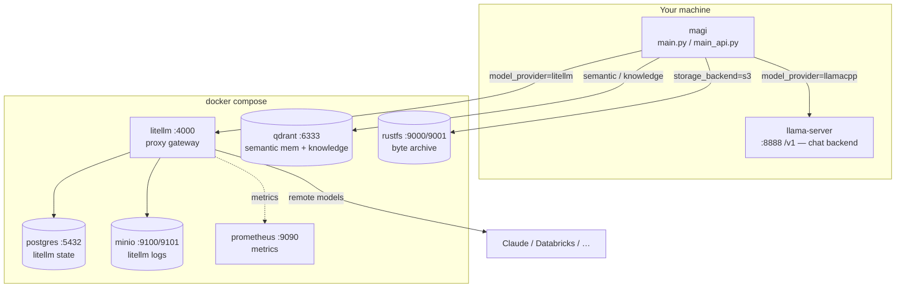

# Infrastructure

magi runs against a handful of supporting services. The chat backend (a
`llama-server`) you run yourself; the rest are bundled in
[`docker-compose.yaml`](../docker-compose.yaml). Everything is optional except a
model backend — the app boots and degrades gracefully when a service is down.

## Service map



## Ports at a glance

| Service | Host port(s) | Role |
|---|---|---|
| llama-server | `8888` (your launch) | OpenAI-compatible chat backend (default deployment) |
| LiteLLM proxy | `4000` | Gateway to remote models (Claude/Databricks) + dormant Ollama |
| Postgres | `5432` | LiteLLM state |
| Qdrant | `6333` (HTTP), `6334` (gRPC) | Vector store: semantic memory + knowledge |
| RustFS | `9000` (S3 API), `9001` (console) | The chatbot's durable byte archive |
| MinIO | `9100`, `9101` | LiteLLM's request logs (kept off 9000 so RustFS owns the canonical S3 ports) |
| Prometheus | `9090` | Metrics scraping |

## The chat backend (llama-server)

The default deployment talks **directly** to a `llama.cpp` `llama-server`
(`model_provider="llamacpp"`, `llamacpp_base_url="http://127.0.0.1:8888/v1"`). One
model per instance; the context window is fixed at launch with `--ctx-size` — keep
`lead_num_ctx`/`member_num_ctx` equal to it. Load an `mmproj` for vision so inbound
images are actually seen. See the memory file `llama-server-backend` for backend
quirks (jinja/tools defaults, native per-request sampling, the thinking+tools leak
that the bundled entrypoints disable via `chat_template_kwargs.enable_thinking`).

To route through Claude or another remote model instead, set
`model_provider="litellm"` and a `lead_model_id` that matches a `model_name` in
[`litellm.config.yaml`](../litellm.config.yaml).

## Bringing up the supporting services

```bash
docker compose up -d                 # everything
docker compose up -d rustfs rustfs-init    # just the byte archive
docker compose up -d litellm postgres      # just the proxy
```

Configuration consumed by the compose stack (proxy keys, Databricks creds, S3
creds) lives in `.env` — see [`.env.example`](../.env.example).

## Running the app in a container

By default magi runs on the host (the service map above). To containerize it
instead, build the image locally from the [`Dockerfile`](../Dockerfile) (uv,
Python 3.14) and bring it up with [`docker-compose.app.yaml`](../docker-compose.app.yaml),
which layers the app onto the supporting services:

```bash
docker compose -f docker-compose.app.yaml up --build api          # API on :8000
docker compose -f docker-compose.yaml -f docker-compose.app.yaml up --build   # + infra
docker compose -f docker-compose.app.yaml --profile discord up --build discord
```

The container reaches the host's `llama-server` and any host-published service
via `host.docker.internal` (compose wires `host-gateway`), mirroring how the
host-run app uses `localhost`. Config stays code-first: the container entrypoints
(`main_api_docker.py` / `main_discord_docker.py`) reuse each deployment's
`apply_deployment_config()` and overlay only the container deltas — bind
`0.0.0.0`, point the backend URL at the host. `./data` is volume-mounted so the
sqlite db, memory files, and local byte archive survive rebuilds. Optional extras
bake in at build time via the `EXTRAS` build arg (e.g. `EXTRAS="--extra s3"`).

## Object storage (byte archive)

The model's durable file/image archive ([memory.md](memory.md), README). Two
backends via `storage_backend`:

- **`local`** — bytes on the filesystem under `storage_local_dir`. Zero setup, no
  Docker, no credentials.
- **`s3`** — any S3-compatible bucket. The bundled RustFS runs on the canonical S3
  ports (`9000`/`9001`) and `rustfs-init` auto-creates the `chatbot-memory` bucket,
  so the default `s3_endpoint_url="http://localhost:9000"` works out of the box.

```bash
docker compose up -d rustfs rustfs-init
# S3 API → http://localhost:9000   console → http://localhost:9001
# default creds: rustfsadmin / rustfsadmin (override via S3_* in .env)
uv sync --extra s3                  # boto3 (lazy-imported; absent → tools off)
```

## Knowledge ingestion

The knowledge corpus is populated **out-of-band** with
[`scripts/ingest_knowledge.py`](../scripts/ingest_knowledge.py) — ingestion is an
explicit action and does *not* check `knowledge_enabled` (that flag only gates the
chat-time `search_knowledge` tool). Embeddings and Qdrant must be reachable (same
endpoints as semantic memory).

```bash
uv run python -m scripts.ingest_knowledge docs/ guide.md --root docs
uv run python -m scripts.ingest_knowledge notes.txt --scope global
```

Only text files are read (`.md`, `.markdown`, `.txt`, `.rst`, `.text`); pass a
directory to ingest everything under it. Re-ingesting a file replaces its prior
chunks, keyed by its `doc_id` (the path relative to `--root`). Then enable the tool
at the entrypoint with `knowledge_enabled=True`.

## Observability

- **Startup banner.** `config.log_settings()` prints every effective setting
  (secrets masked) on boot — the single source of truth for what's live.
- **Per-turn context size.** The memory layer logs the assembled context size and
  warns when it nears the lead's window (`ctx_warn_ratio`).
- **Tool/member calls.** The `tool_call_hook` logs every call with args, timing, and
  result; failures become lead-visible text.
- **Prometheus.** LiteLLM exposes metrics scraped by the bundled Prometheus
  (`:9090`), configured in [`prometheus.yml`](../prometheus.yml).
