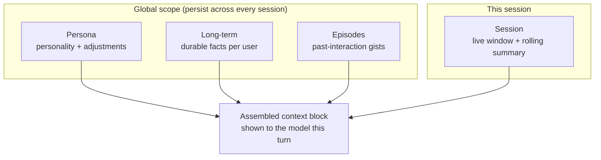
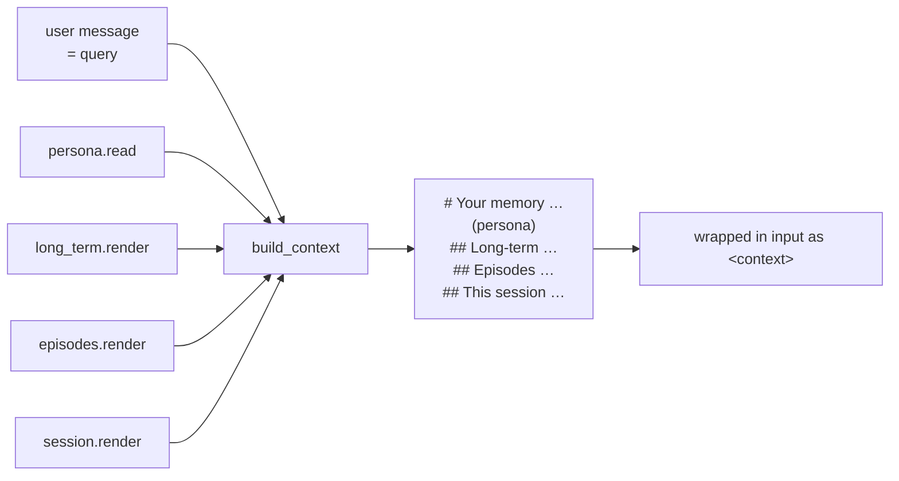

# Deliberate memory

Memory is the heart of magi. Unlike frameworks that silently auto-extract "facts"
from conversations, magi's memory is **deliberate**: durable, inspectable files
that are written *on purpose*, and one layer that assembles them into the context
block the model sees each turn.

> The domain vocabulary (kind, episode, session, persona, fold, curate, scope,
> knowledge) is defined canonically in [`CONTEXT.md`](../CONTEXT.md). This document
> shows how the pieces fit together. The module split is justified in
> [ADR 0001](adr/0001-per-kind-memory-modules.md).

## The kinds

A memory **kind** is one unit of memory with its own storage, render, and
(sometimes) fold. magi has four scoped kinds plus one global kind:

| Kind | Scope | Folds? | What it holds | Renders into |
|---|---|---|---|---|
| **Session** (short-term) | per (user, session) | yes | A capped window of recent turns + a rolling summary of evicted turns | "this session" |
| **Long-term** | per user | yes¹ | Durable facts the assistant keeps about a user | "global" |
| **Episodes** | per user | no | Gists of whole past interactions | "global" |
| **Persona** | global | no | Base personality + evolved behavioral adjustments | first section |

¹ Long-term folds only on the *no-curator* path. When the curator is on (the
default deployment), it owns the profile and the legacy fold never fires.



## Context assembly

Before each run, [`MemoryManager.build_context`](../src/magi/core/memory/manager.py)
renders every non-empty kind into one block, in a fixed order owned by the
manager (persona → long-term → episodes → short-term). The inbound message is the
retrieval query (used when semantic search is on).



The block is injected into the run **input** (not the shared runner) so concurrent
sessions can't leak memory into one another. A size estimate (~4 chars/token) is
logged each turn and warns when the assembled context crosses `ctx_warn_ratio` of
the lead's window — a guardrail only, it never truncates.

## The curator — who writes durable memory

Durable memory is owned by a **post-turn curator**, not by the lead writing facts
inline. After each reply, the curator (a cheap member-model call, off the reply
path) reads the finished turn against the current facts (each tagged with an id)
and the persona, and revises the fact sheet **per fact** — so it can update or
supersede, not just append.

```mermaid
sequenceDiagram
    participant CS as ConversationService
    participant Mem as MemoryManager
    participant Cur as Curator (member model)
    participant Files as Durable files

    Note over CS: reply already sent to the user
    CS->>Mem: maybe_curate(user_msg, reply)
    Mem->>Cur: turn + current facts(+ids) + persona
    Cur-->>Mem: { operations:[ADD/UPDATE/DELETE], episode?, persona? }
    Mem->>Files: apply per-fact ops
    Mem->>Files: record episode (if any)
    Mem->>Files: append persona adjustment (if any)
    Note over Cur,Files: malformed output → no-op; any error swallowed
```

- The common case is **"nothing changed"** — no operations, no episode, no persona
  adjustment.
- Parsing is defensive: the curator returns JSON, but any malformed output degrades
  to a no-op and never raises. The manager swallows failures anyway — curation must
  never break a chat.
- The *what-to-remember policy* is a prompt file
  ([`prompts/curation.md`](../src/magi/prompts/curation.md)), loaded via the overlay
  seam so a persona can supply its own policy. The mechanism (apply ops, clamp,
  prune) is public; the policy is overlay-able.
- Guardrails: per-fact size clamp (`long_term_fact_max_chars`) and a soft cap on
  total facts (`long_term_facts_max`, oldest dropped with a warning).

When the curator is **off**, durable memory falls back to the older path: the lead
writes facts and the long-term kind folds them into a condensed profile itself.

## Session folding

The live window keeps the most recent `short_term_max` turns. Turns that roll out
are held in a **pending buffer**; when it reaches `summarize_every`, the injected
session summarizer folds them into a rolling "session so far" summary that stays in
context. On `flush` (session close), that summary is also recorded as a global
**episode** so the gist survives.


Caps keep a failing summarizer from compounding: the pending buffer is bounded
(`session_pending_max`, oldest dropped) and the summary blob is clamped
(`session_summary_max_chars`) so a runaway output isn't replayed every turn.

## What the lead can do directly

The lead keeps only **read** tools (`recall_memory`, `recall_episodes`) for
explicit deeper lookups — and rarely needs even those, since `build_context`
already injects the current profile, episodes, and window every turn. Writes are
the curator's job. See [agent-and-tools.md](agent-and-tools.md#memory-tools).

## Scope and concurrency

A **scope** is the `(user_id, session_id)` a memory operation belongs to. It is set
once per message via `set_scope` and read through a process-global `ContextVar` —
never threaded as a tool argument.

> **Do not regress:** `MemoryManager` is a single shared instance across all
> sessions. `self.mem` (the `ScopedMemory` file bundle) MUST stay a per-access
> property rebuilt from the current scope — never cached on the instance — or two
> interleaved async sessions leak each other's files. See the concurrency note in
> [ADR 0001](adr/0001-per-kind-memory-modules.md).

## On-disk layout

Files live under `memory_dir` (default `data/memory/`):

```
data/memory/
  persona.md                         # global
  users/<user_id>/
    long_term_facts.json             # curator-owned fact sheet (ids)
    long_term.md                     # raw facts / fallback profile
    long_term_summary.md             # condensed profile (no-curator fold)
    episodic.md                      # episode gists
    sessions/<session_id>.json       # live window
    sessions/<session_id>.pending.json   # evicted-turn buffer
    sessions/<session_id>.summary.md     # rolling session summary
```

## Memory vs. knowledge

Do not conflate the two — different lifecycle, different store:

| | **Memory** (`magi/core/memory`) | **Knowledge** (`magi/core/knowledge`) |
|---|---|---|
| Origin | Per-user, conversation-derived | A shared *document* corpus |
| Who writes it | The curator (deliberate) | Ingested out-of-band, faithfully |
| Extraction | n/a | None — chunks are source text (no LLM rewrite) |
| Store | Files (+ optional Qdrant) | Its own Qdrant collection |
| Read by | Injected into context every turn | The `search_knowledge` tool, on demand |

Knowledge is a global, read-only RAG corpus populated by
[`scripts/ingest_knowledge.py`](../scripts/ingest_knowledge.py), gated by
`knowledge_enabled`, degrading to no tool when Qdrant/embeddings are down. See
[configuration.md](configuration.md#knowledge-layer-rag) and
[infrastructure.md](infrastructure.md#knowledge-ingestion).
