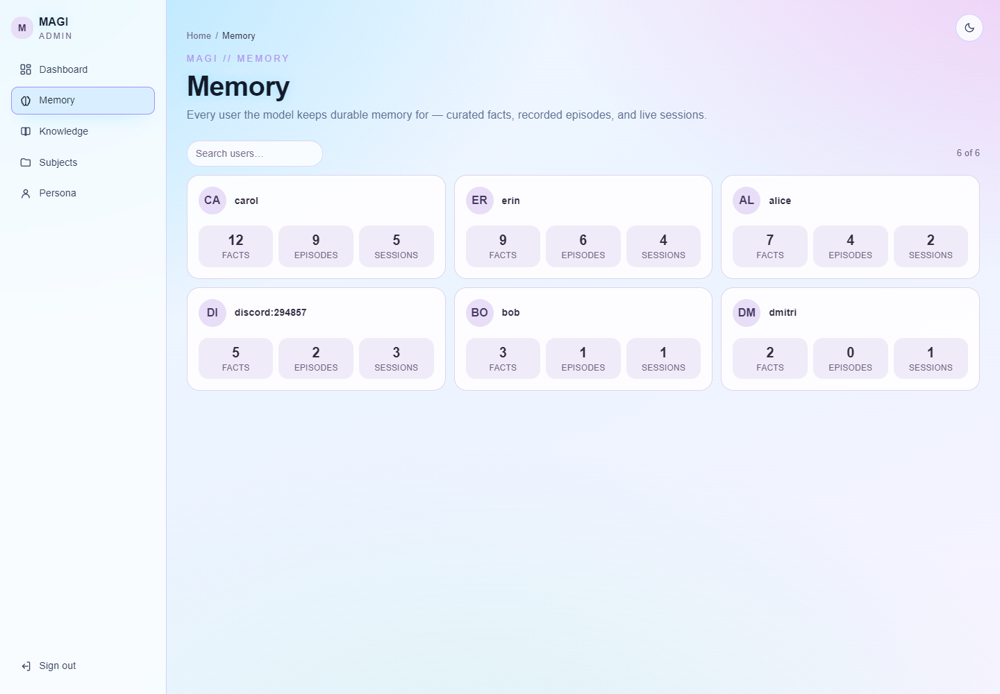
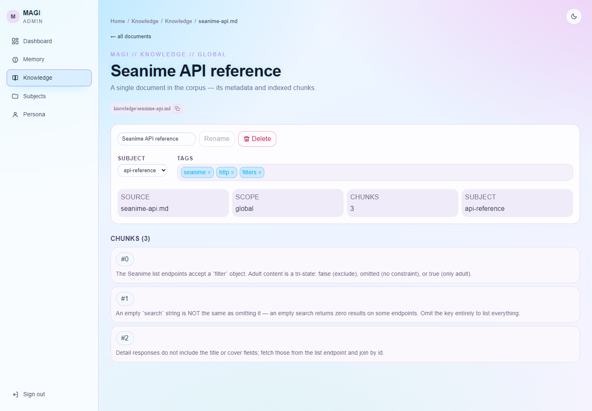
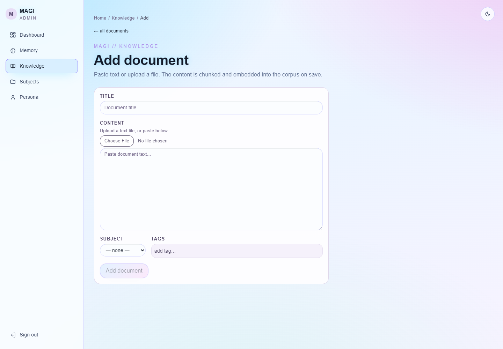

# MAGI Admin

A web dashboard for operating the MAGI assistant — **inspect and edit everything
it remembers**, and manage the knowledge it can search. It's the human-facing
counterpart to MAGI's *deliberate memory*: durable facts, episodes, sessions,
persona, and the document corpus, all browsable and editable in one place.

Built with **Next.js** (App Router) on the [`@carneirofc/ui`](https://github.com/carneirofc/deedlit.dev)
design system (Tailwind v4 + Radix), with light/dark themes.

<p align="center">
  
</p>

## What you can do

| Area | Capabilities |
|---|---|
| **Dashboard** | At-a-glance counts (users, facts, episodes, sessions, documents, chunks, subjects), recent documents, top users, and a live backend-health indicator. |
| **Chat** | A streaming console for talking to the running brain — probe routing, tools, and what it remembers for any user. Set the `user_id` to chat *as* that user (scoping durable memory); **New chat** rotates the conversation. Sender avatars, image/file attachments (click an image to zoom), live *thinking* + tool cards, `mermaid` fenced blocks rendered as diagrams, and a per-turn context-window meter. Built on [assistant-ui](https://github.com/assistant-ui/assistant-ui) over SSE. |
| **Memory** | Browse/search users; per-user **facts as editable cards** (add / edit / delete with confirmation), episodes, and sessions — organized under tabs. |
| **Sessions** | Read a session as a **chat transcript** (role-colored bubbles) or edit the raw window / summary / pending buffer. |
| **Knowledge** | Browse the corpus as a **table or cards**, filter by subject (hard) and tag (soft), add documents by paste or file upload, and rename / retag / delete with chunk inspection. |
| **Subjects** | Manage the controlled vocabulary documents are grouped by. |
| **Persona** | Edit the global personality shared across all users. |

## How it works (security model)

It is a **BFF** (backend-for-frontend): the browser only ever talks to this
Next.js server, which holds the admin-api bearer token **server-side** and gates
the operator with a password → httpOnly session cookie. The token never reaches
the browser, and the Python `admin-api` is never exposed publicly (compose-network
only). See [`docs/adr/0002`](../docs/adr/0002-admin-interface-for-memory-and-knowledge.md).

The **Chat** and **Team** pages read a *second* upstream — the Python `chat-api`
(`channels/api.py`, the process that runs the team) — using `CHAT_API_URL` +
`API_AUTH_TOKEN`. The same rule holds: the browser only reaches the BFF. Chat
messages POST to `/api/chat`, which attaches the bearer server-side and pipes the
chat-api's SSE stream (`delta`/`done` frames) straight back to the browser.

## Screenshots

| | |
|---|---|
| **Dashboard** — metrics + health | **Memory** — searchable users |
| [](docs/screenshots/02-dashboard.png) | [](docs/screenshots/03-memory.png) |
| **User** — facts as cards, tabs | **Session** — chat transcript |
| [](docs/screenshots/04-user-detail.png) | [](docs/screenshots/05-session.png) |
| **Knowledge** — table / cards + filters | **Document** — chunks + metadata |
| [](docs/screenshots/06-knowledge.png) | [](docs/screenshots/10-document.png) |
| **Add document** — paste or upload | **Persona** — global personality |
| [](docs/screenshots/07-knowledge-add.png) | [](docs/screenshots/09-persona.png) |

Dark theme is a click away (the toggle floats top-right, and is draggable):

<p align="center">
  
</p>

## Quickstart

### 1. Install `@carneirofc/ui` (one-time auth setup)

The UI kit is published to **GitHub Packages**, which requires auth even for
public packages. Create a GitHub **Personal Access Token (classic)** with the
`read:packages` scope (github.com → Settings → Developer settings → Tokens — the
`gh` CLI token does *not* carry this scope). [`.npmrc`](.npmrc) already scopes
`@carneirofc/*` to that registry and reads the token from `NODE_AUTH_TOKEN`:

```bash
export NODE_AUTH_TOKEN=ghp_xxx      # PowerShell: $env:NODE_AUTH_TOKEN = "ghp_xxx"
```

### 2. Configure + run

```bash
cp .env.example .env.local          # set ADMIN_API_URL, ADMIN_AUTH_TOKEN, ADMIN_PASSWORD, SESSION_SECRET
# start the Python admin-api in another shell: `python main.py admin` (binds :8100)
npm install
npm run gen:api                     # regenerate src/lib/api-types.ts from the live admin-api OpenAPI
npm run dev                         # http://localhost:3000  → sign in with ADMIN_PASSWORD
```

## Configuration (server-side only — never shipped to the browser)

| Var | Purpose |
|---|---|
| `ADMIN_API_URL` | Base URL of the Python admin-api (e.g. `http://admin-api:8100` in compose). |
| `ADMIN_AUTH_TOKEN` | Bearer the BFF presents to admin-api. Must equal admin-api's `ADMIN_AUTH_TOKEN`. |
| `CHAT_API_URL` | Base URL of the Python chat-api (`channels/api.py`) — read by the Chat & Team pages. Defaults to `http://127.0.0.1:8000`. |
| `API_AUTH_TOKEN` | Bearer the BFF presents to chat-api. Must equal chat-api's `API_AUTH_TOKEN` (blank if it runs auth-disabled). |
| `ADMIN_PASSWORD` | The single operator password the login screen checks. |
| `SESSION_SECRET` | HMAC secret for signing the session cookie (any long random string). |
| `NODE_AUTH_TOKEN` | **Build-time only.** GitHub PAT (`read:packages`) to install `@carneirofc/ui`. Not read at runtime. |

## Docker

Built as a standalone Node server (`output: "standalone"`). The `@carneirofc/ui`
install needs the `read:packages` token, passed as a **build secret** so it never
lands in an image layer:

```bash
export NODE_AUTH_TOKEN=ghp_xxx
docker build --secret id=node_auth_token,env=NODE_AUTH_TOKEN -t magi-admin-web:local ./web
```

Or bring it up with the app stack under the `admin` profile (the compose file
wires the same secret from `NODE_AUTH_TOKEN`):

```bash
export NODE_AUTH_TOKEN=ghp_xxx
docker compose -f docker-compose.app.yaml --profile admin up --build
# web → http://localhost:3000 ; admin-api stays internal to the compose network
```

## Design system

Tailwind v4 runs as a PostCSS plugin ([`postcss.config.mjs`](postcss.config.mjs)).
Tokens, fonts, and the `.cyber-*` component classes come from
`@carneirofc/ui/styles.css`, imported once in [`src/app/globals.css`](src/app/globals.css)
alongside an `@source` pointing at the kit's compiled output (so Tailwind keeps
the utility classes those components emit). Theme is `data-theme` on `<html>`,
initialised flash-free in the root layout and toggled by the kit's draggable
`ThemeToggleButton`. Currently pinned to `@carneirofc/ui@^0.2.0`.

## Project layout

```
src/
  middleware.ts                       # auth gate → /login unless a valid session cookie
  lib/
    session.ts                        # signed httpOnly cookie (Web Crypto HMAC)
    admin-api.ts                      # server-only client; holds the bearer
    chat-api.ts                       # server-only chat-api client (introspection + SSE stream)
    chat-adapter.ts                   # assistant-ui ChatModelAdapter over the /api/chat SSE
    api-types.ts                      # GENERATED by `npm run gen:api`
  components/
    AppShell / Sidebar / Topbar       # chrome: rail (active nav) + breadcrumb bar
    ChatConsole                       # streaming chat playground (assistant-ui + @carneirofc/ui)
    StatCard                          # dashboard metric tile
    UserGrid                          # searchable user cards
    FactEditor                        # memory cards: add / edit / delete
    MemoryTabs                        # facts / episodes / sessions switcher
    SessionFile                       # transcript viewer + raw editor
    RawFileEditor                     # generic raw-file editor (persona, episodes)
    KnowledgeList / AddKnowledge      # corpus table+cards / ingest form
    DocumentActions / DocumentMeta    # rename+delete / subject+tags
    SubjectManager / CopyId           # subject CRUD / copy-to-clipboard IDs
  app/
    layout.tsx                        # root: theme init + global ThemeToggleButton
    login/page.tsx                    # password login (outside the (app) group)
    (app)/                            # authed dashboard group — wrapped in AppShell
      layout.tsx  loading.tsx  error.tsx
      page.tsx                        # Dashboard
      chat/  memory/…  knowledge/…  subjects/  persona/  team/
    api/auth/**   api/admin/**        # session set/clear + BFF mutation proxies
    api/chat/route.ts                 # BFF SSE proxy → chat-api messages/stream
```
